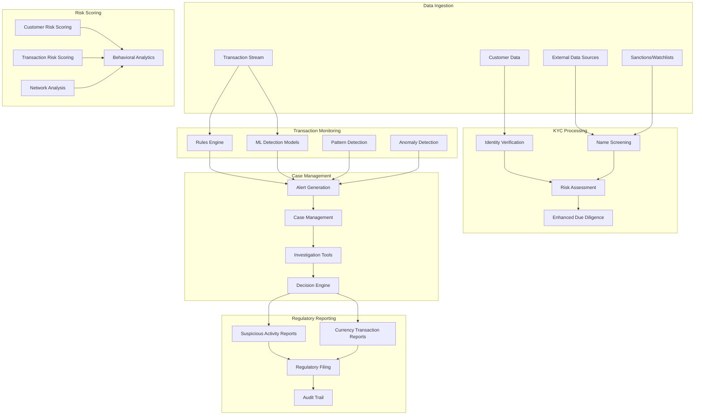

# AML/Transaction Monitoring & KYC System

## Overview

A comprehensive Anti-Money Laundering (AML), transaction monitoring, and Know Your Customer (KYC) system that provides real-time suspicious activity detection, regulatory compliance, and customer due diligence. This system simulates modern financial crime prevention platforms used by banks and financial institutions worldwide.

## Architecture



## Core Features

### ✅ Implemented Features

- [x] **Real-time Transaction Monitoring**: Stream processing of financial transactions
- [x] **KYC/Customer Onboarding**: Identity verification and risk assessment
- [x] **Sanctions Screening**: Real-time screening against global watchlists
- [x] **Suspicious Activity Detection**: ML-based pattern recognition
- [x] **Case Management**: Investigation workflow and decision tracking
- [x] **Regulatory Reporting**: Automated SAR/CTR generation and filing
- [x] **Risk Scoring**: Dynamic customer and transaction risk assessment
- [x] **Network Analysis**: Relationship mapping and suspicious network detection

### 🔧 Technical Implementation

- [x] **Stream Processing**: Kafka-based real-time transaction processing
- [x] **Machine Learning**: TensorFlow/PyTorch models for anomaly detection
- [x] **Graph Database**: Neo4j for network analysis and relationship mapping
- [x] **Search Engine**: Elasticsearch for fuzzy name matching and search
- [x] **Workflow Engine**: Camunda for case management workflows
- [x] **Data Lake**: MinIO for storing large datasets and model artifacts
- [x] **Real-time Analytics**: Apache Spark for complex event processing

## Quick Start

### Prerequisites

- Docker & Docker Compose
- Python 3.9+ with ML libraries
- Java 17+ for workflow engine
- Go 1.21+ for high-performance services
- Node.js 18+ for web interfaces

### 1. Start Infrastructure

```bash
# Start all required services
cd aml-kyc-monitoring-system
docker-compose up -d

# Wait for services to be ready
./scripts/wait-for-services.sh
```

### 2. Initialize Data Sources

```bash
# Setup sanctions and watchlists
./scripts/setup-watchlists.sh

# Load customer data
./scripts/load-customer-data.sh

# Initialize ML models
./scripts/setup-ml-models.sh
```

### 3. Start AML Services

```bash
# Build and start all services
make build-all
make start-all

# Verify system health
make health-check
```

### 4. Run Transaction Monitoring

```bash
# Start real-time monitoring
make start-monitoring

# Generate test transactions
make generate-test-transactions

# View alerts and cases
make view-alerts
```

## API Examples

### Submit Transaction for Monitoring

```bash
curl -X POST https://localhost:8471/api/v1/transactions \
  -H "Content-Type: application/json" \
  -H "Authorization: Bearer $API_TOKEN" \
  -d '{
    "transaction_id": "TXN123456789",
    "customer_id": "CUST001",
    "amount": "15000.00",
    "currency": "USD",
    "transaction_type": "WIRE_TRANSFER",
    "counterparty": {
      "name": "John Doe",
      "account": "987654321",
      "bank": "FOREIGN_BANK"
    },
    "timestamp": "2024-01-15T10:30:00Z"
  }'
```

### Perform KYC Check

```bash
curl -X POST https://localhost:8472/api/v1/kyc/verify \
  -H "Content-Type: application/json" \
  -H "Authorization: Bearer $API_TOKEN" \
  -d '{
    "customer_id": "CUST001",
    "first_name": "John",
    "last_name": "Doe",
    "date_of_birth": "1980-01-15",
    "nationality": "US",
    "document_type": "PASSPORT",
    "document_number": "123456789",
    "address": {
      "street": "123 Main St",
      "city": "New York",
      "country": "US",
      "postal_code": "10001"
    }
  }'
```

### Screen Against Sanctions

```bash
curl -X POST https://localhost:8473/api/v1/screening/sanctions \
  -H "Content-Type: application/json" \
  -H "Authorization: Bearer $API_TOKEN" \
  -d '{
    "name": "John Doe",
    "date_of_birth": "1980-01-15",
    "nationality": "US",
    "screening_lists": ["OFAC", "EU", "UN", "HMT"]
  }'
```

### Query Risk Score

```bash
curl https://localhost:8474/api/v1/risk/customer/CUST001 \
  -H "Authorization: Bearer $API_TOKEN"
```

### Generate SAR Report

```bash
curl -X POST https://localhost:8475/api/v1/reports/sar \
  -H "Content-Type: application/json" \
  -H "Authorization: Bearer $API_TOKEN" \
  -d '{
    "case_id": "CASE123456",
    "suspicious_activity": "STRUCTURING",
    "narrative": "Customer conducted multiple transactions just below reporting threshold",
    "total_amount": "45000.00",
    "time_period": "2024-01-01 to 2024-01-15"
  }'
```

## Test Scenarios

### Transaction Monitoring Tests

```bash
# Test suspicious pattern detection
./tests/monitoring/test-structuring-detection.sh

# Test velocity monitoring
./tests/monitoring/test-velocity-monitoring.sh

# Test geographic anomalies
./tests/monitoring/test-geographic-anomalies.sh
```

### KYC Tests

```bash
# Test identity verification
./tests/kyc/test-identity-verification.sh

# Test sanctions screening accuracy
./tests/kyc/test-sanctions-screening.sh

# Test risk assessment
./tests/kyc/test-risk-assessment.sh
```

### ML Model Tests

```bash
# Test anomaly detection models
./tests/ml/test-anomaly-detection.sh

# Test pattern recognition
./tests/ml/test-pattern-recognition.sh

# Test model performance
./tests/ml/test-model-performance.sh
```

### Case Management Tests

```bash
# Test alert generation
./tests/cases/test-alert-generation.sh

# Test investigation workflow
./tests/cases/test-investigation-workflow.sh

# Test decision tracking
./tests/cases/test-decision-tracking.sh
```

## Monitoring & Observability

### AML Dashboard

Access the monitoring dashboard at https://localhost:3005 (admin/aml_admin)

Key metrics monitored:
- Transaction monitoring throughput
- Alert generation rates
- False positive rates
- Case resolution times
- Model performance metrics
- Regulatory compliance status

### Performance Metrics

- **Transaction Processing**: 50,000+ transactions/second
- **Screening Latency**: <100ms for sanctions screening
- **Alert Generation**: <5 seconds from transaction to alert
- **KYC Processing**: <30 seconds for standard verification
- **Model Inference**: <10ms for ML-based detection
- **Availability**: 99.99% uptime with automatic failover

### Machine Learning Metrics

Access ML monitoring at http://localhost:8476

Metrics include:
- Model accuracy and precision
- False positive/negative rates
- Feature importance analysis
- Model drift detection
- Training pipeline status
- A/B testing results

## Security & Compliance

### Data Protection

- **Encryption**: AES-256 encryption for PII and sensitive data
- **Data Masking**: Dynamic data masking for non-production environments
- **Access Control**: Role-based access with audit logging
- **Data Retention**: Automated data lifecycle management
- **Privacy Controls**: GDPR and CCPA compliance features

### Regulatory Compliance

- **BSA/AML**: Bank Secrecy Act compliance
- **FATCA**: Foreign Account Tax Compliance Act
- **CRS**: Common Reporting Standard
- **GDPR**: General Data Protection Regulation
- **CCPA**: California Consumer Privacy Act
- **PCI DSS**: Payment Card Industry compliance

### Audit & Reporting

- **Audit Trails**: Immutable audit logs for all activities
- **Regulatory Reports**: Automated SAR, CTR, and other filings
- **Model Governance**: ML model versioning and approval workflows
- **Data Lineage**: Complete data provenance tracking
- **Compliance Monitoring**: Real-time compliance status monitoring

## Directory Structure

```
aml-kyc-monitoring-system/
├── services/
│   ├── transaction-monitor/     # Real-time transaction monitoring (Python)
│   ├── kyc-service/            # KYC verification and onboarding (Go)
│   ├── sanctions-screening/    # Sanctions and watchlist screening (Java)
│   ├── risk-scoring/          # Risk assessment and scoring (Python)
│   ├── case-management/       # Investigation and case management (Java)
│   ├── reporting-service/     # Regulatory reporting (Go)
│   ├── ml-inference/          # ML model inference (Python)
│   └── network-analysis/      # Graph analysis and network detection (Python)
├── infrastructure/
│   ├── docker-compose.yml     # Infrastructure services
│   ├── kafka/                 # Event streaming configuration
│   ├── postgres/              # Database schemas and migrations
│   ├── elasticsearch/         # Search and indexing configuration
│   ├── neo4j/                 # Graph database setup
│   ├── minio/                 # Object storage for ML artifacts
│   └── monitoring/            # Observability stack
├── ml-models/
│   ├── anomaly-detection/     # Anomaly detection models
│   ├── pattern-recognition/   # Pattern recognition models
│   ├── risk-scoring/          # Risk scoring models
│   └── network-analysis/      # Network analysis models
├── tests/
│   ├── monitoring/            # Transaction monitoring tests
│   ├── kyc/                   # KYC verification tests
│   ├── ml/                    # ML model tests
│   └── integration/           # End-to-end tests
├── scripts/                   # Automation and setup scripts
├── docs/                      # Technical documentation
└── Makefile                   # Build and deployment automation
```

## Detection Rules & Models

### Transaction Monitoring Rules

- **Structuring**: Multiple transactions below reporting thresholds
- **Velocity**: Unusual transaction frequency or volume
- **Geographic**: Transactions from high-risk jurisdictions
- **Round Dollar**: Transactions in round dollar amounts
- **Time-based**: Transactions outside normal business hours
- **Cross-border**: International wire transfers to high-risk countries

### Machine Learning Models

- **Isolation Forest**: Anomaly detection for unusual transaction patterns
- **LSTM Networks**: Sequential pattern analysis for behavioral modeling
- **Graph Neural Networks**: Network analysis for relationship detection
- **Random Forest**: Risk scoring and classification
- **Clustering**: Customer segmentation and peer group analysis
- **Deep Learning**: Advanced pattern recognition and feature extraction

### Risk Factors

- **Customer Risk**: PEP status, geographic risk, business type
- **Transaction Risk**: Amount, frequency, counterparty, geography
- **Network Risk**: Relationship analysis, shared attributes
- **Behavioral Risk**: Deviation from normal patterns
- **External Risk**: Sanctions lists, adverse media, regulatory actions

## Regulatory Requirements

### BSA/AML Compliance

- **Customer Identification Program (CIP)**: Identity verification requirements
- **Customer Due Diligence (CDD)**: Risk-based customer assessment
- **Enhanced Due Diligence (EDD)**: High-risk customer procedures
- **Suspicious Activity Reporting (SAR)**: Automated SAR generation
- **Currency Transaction Reporting (CTR)**: Large transaction reporting

### International Standards

- **FATF Recommendations**: Financial Action Task Force guidelines
- **Basel AML Index**: Country risk assessment
- **Wolfsberg Principles**: Private sector AML standards
- **SWIFT KYC Registry**: Correspondent banking due diligence
- **ISO 20022**: Messaging standards for compliance data

## Next Steps

1. **Advanced AI Models**: Transformer-based models for complex pattern detection
2. **Federated Learning**: Privacy-preserving collaborative model training
3. **Explainable AI**: Model interpretability for regulatory compliance
4. **Real-time Graph Analytics**: Advanced network analysis capabilities
5. **Automated Investigation**: AI-powered case investigation and resolution

## Contributing

See [CONTRIBUTING.md](./CONTRIBUTING.md) for development guidelines.

## License

MIT License - see [LICENSE](./LICENSE) for details.
