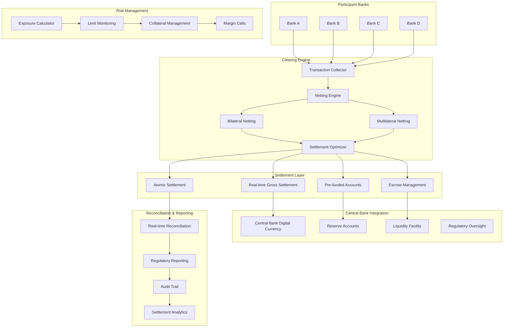

# Clearing & Settlement Engine

## Overview

A comprehensive interbank clearing and settlement system that handles bilateral and multilateral netting, T+1 settlement cycles, atomic settlement across multiple ledgers, and real-time risk management. This system simulates modern clearing houses like The Clearing House (TCH), LCH, and central bank settlement systems.

## Architecture



## Core Features

### ✅ Implemented Features

- [x] **Bilateral Netting**: Pairwise settlement optimization between banks
- [x] **Multilateral Netting**: System-wide netting across all participants
- [x] **T+1 Settlement Cycles**: End-of-day batch settlement processing
- [x] **Atomic Settlement**: All-or-nothing settlement across multiple ledgers
- [x] **Real-time Risk Management**: Continuous exposure monitoring and limits
- [x] **Collateral Management**: Dynamic collateral requirements and margin calls
- [x] **Central Bank Integration**: RTGS and reserve account management
- [x] **Regulatory Reporting**: Automated compliance and oversight reporting

### 🔧 Technical Implementation

- [x] **Event-driven Architecture**: Kafka-based settlement event processing
- [x] **Distributed Ledger**: Multi-ledger atomic transactions with 2PC
- [x] **High Availability**: Active-passive clustering with automatic failover
- [x] **Real-time Analytics**: Stream processing for settlement optimization
- [x] **Cryptographic Integrity**: Digital signatures and hash chains
- [x] **Performance Optimization**: Sub-second netting calculations
- [x] **Monitoring**: Comprehensive metrics and distributed tracing

## Quick Start

### Prerequisites

- Docker & Docker Compose
- Java 17+ and Go 1.21+
- Python 3.9+ for analytics
- Make

### 1. Start Infrastructure

```bash
# Start all required services
cd clearing-settlement-engine
docker-compose up -d

# Wait for services to be ready
./scripts/wait-for-services.sh
```

### 2. Initialize Settlement Networks

```bash
# Setup clearing participants and accounts
./scripts/setup-participants.sh

# Initialize collateral pools
./scripts/setup-collateral.sh

# Load test transactions
./scripts/load-test-transactions.sh
```

### 3. Start Settlement Services

```bash
# Build and start all services
make build-all
make start-all

# Verify system health
make health-check
```

### 4. Run Settlement Cycle

```bash
# Run end-of-day settlement
make run-settlement-cycle

# Run bilateral netting
make run-bilateral-netting

# Run multilateral netting
make run-multilateral-netting
```

## API Examples

### Submit Transaction for Clearing

```bash
curl -X POST https://localhost:8461/api/v1/transactions \
  -H "Content-Type: application/json" \
  -H "Authorization: Bearer $API_TOKEN" \
  -d '{
    "transaction_id": "TXN123456789",
    "payer_bank": "BANK001",
    "payee_bank": "BANK002",
    "amount": "1000000.00",
    "currency": "USD",
    "value_date": "2024-01-15",
    "transaction_type": "CREDIT_TRANSFER",
    "priority": "NORMAL"
  }'
```

### Trigger Bilateral Netting

```bash
curl -X POST https://localhost:8461/api/v1/netting/bilateral \
  -H "Content-Type: application/json" \
  -H "Authorization: Bearer $API_TOKEN" \
  -d '{
    "bank_pair": ["BANK001", "BANK002"],
    "currency": "USD",
    "cutoff_time": "2024-01-15T16:00:00Z"
  }'
```

### Execute Settlement

```bash
curl -X POST https://localhost:8462/api/v1/settlement/execute \
  -H "Content-Type: application/json" \
  -H "Authorization: Bearer $API_TOKEN" \
  -d '{
    "settlement_batch_id": "BATCH_20240115_001",
    "settlement_method": "RTGS",
    "participants": ["BANK001", "BANK002", "BANK003"],
    "total_amount": "50000000.00",
    "currency": "USD"
  }'
```

### Check Settlement Status

```bash
curl https://localhost:8462/api/v1/settlement/BATCH_20240115_001/status \
  -H "Authorization: Bearer $API_TOKEN"
```

### Query Risk Exposure

```bash
curl https://localhost:8463/api/v1/risk/exposure/BANK001 \
  -H "Authorization: Bearer $API_TOKEN"
```

## Test Scenarios

### Settlement Cycle Tests

```bash
# Test complete T+1 settlement cycle
./tests/settlement/test-t1-cycle.sh

# Test settlement optimization
./tests/settlement/test-optimization.sh

# Test atomic settlement across ledgers
./tests/settlement/test-atomic-settlement.sh
```

### Netting Tests

```bash
# Test bilateral netting accuracy
./tests/netting/test-bilateral-netting.sh

# Test multilateral netting optimization
./tests/netting/test-multilateral-netting.sh

# Test netting with multiple currencies
./tests/netting/test-multicurrency-netting.sh
```

### Risk Management Tests

```bash
# Test exposure limit monitoring
./tests/risk/test-exposure-limits.sh

# Test collateral management
./tests/risk/test-collateral-management.sh

# Test margin call processing
./tests/risk/test-margin-calls.sh
```

### High Availability Tests

```bash
# Test settlement system failover
./tests/ha/test-settlement-failover.sh

# Test data consistency during failures
./tests/ha/test-data-consistency.sh

# Test recovery procedures
./tests/ha/test-disaster-recovery.sh
```

## Monitoring & Observability

### Settlement Dashboard

Access the monitoring dashboard at https://localhost:3004 (admin/settlement_admin)

Key metrics monitored:
- Settlement cycle completion times
- Netting efficiency ratios
- Risk exposure levels
- Collateral utilization
- System throughput (transactions/second)
- Settlement success rates
- Regulatory compliance status

### Performance Metrics

- **Settlement Latency**: <30 seconds for bilateral netting
- **Multilateral Netting**: <2 minutes for system-wide optimization
- **Throughput**: 100,000+ transactions per settlement cycle
- **Availability**: 99.99% uptime with automatic failover
- **Risk Calculation**: <1 second for exposure updates
- **Atomic Settlement**: <5 seconds for multi-ledger commits

### Distributed Tracing

Access Jaeger at http://localhost:16690

Traces include:
- End-to-end settlement processing
- Netting algorithm execution
- Risk calculation workflows
- Collateral management processes
- Regulatory reporting generation

## Security & Compliance

### Settlement Security

- **Cryptographic Integrity**: SHA-256 hash chains for settlement batches
- **Digital Signatures**: PKI-based transaction authentication
- **Access Control**: Role-based permissions for settlement operations
- **Audit Trails**: Immutable logs of all settlement activities
- **Data Encryption**: AES-256 encryption for sensitive data

### Regulatory Compliance

- **Basel III**: Capital adequacy and liquidity requirements
- **PFMI**: Principles for Financial Market Infrastructures
- **CPSS-IOSCO**: International settlement standards
- **Central Bank Oversight**: Real-time reporting to regulatory authorities
- **Stress Testing**: Regular stress testing and scenario analysis

### Risk Management

- **Real-time Monitoring**: Continuous exposure and limit monitoring
- **Collateral Optimization**: Dynamic collateral allocation
- **Margin Requirements**: Risk-based margin calculations
- **Liquidity Management**: Intraday liquidity monitoring
- **Default Management**: Automated default handling procedures

## Directory Structure

```
clearing-settlement-engine/
├── services/
│   ├── transaction-collector/    # Transaction ingestion (Go)
│   ├── netting-engine/          # Bilateral/multilateral netting (Java)
│   ├── settlement-processor/    # Settlement execution (Go)
│   ├── risk-manager/           # Risk and exposure management (Java)
│   ├── collateral-manager/     # Collateral optimization (Python)
│   ├── reporting-service/      # Regulatory reporting (Go)
│   └── reconciliation-service/ # Settlement reconciliation (Java)
├── infrastructure/
│   ├── docker-compose.yml      # Infrastructure services
│   ├── kafka/                  # Event streaming configuration
│   ├── postgres/               # Database schemas and migrations
│   ├── redis/                  # Caching and session management
│   └── monitoring/             # Observability stack
├── tests/
│   ├── settlement/             # Settlement cycle tests
│   ├── netting/               # Netting algorithm tests
│   ├── risk/                  # Risk management tests
│   └── integration/           # End-to-end tests
├── scripts/                   # Automation and setup scripts
├── docs/                      # Technical documentation
└── Makefile                   # Build and deployment automation
```

## Settlement Methods Supported

### Domestic Settlement

- **Real-time Gross Settlement (RTGS)**: Immediate final settlement
- **Deferred Net Settlement (DNS)**: Batch settlement with netting
- **Continuous Linked Settlement (CLS)**: FX settlement risk mitigation
- **Central Bank Digital Currency (CBDC)**: Digital currency settlement

### Cross-border Settlement

- **Correspondent Banking**: Traditional correspondent relationships
- **Payment vs Payment (PvP)**: Simultaneous currency exchange
- **Nostro/Vostro Accounts**: Pre-funded settlement accounts
- **Central Bank Cooperation**: Cross-border CBDC settlement

## Netting Algorithms

### Bilateral Netting

- **Simple Bilateral**: Pairwise netting between two participants
- **Close-out Netting**: Netting upon default or termination
- **Payment Netting**: Netting of payment obligations
- **Novation**: Legal replacement of obligations

### Multilateral Netting

- **Ring Netting**: Circular settlement optimization
- **Star Netting**: Central counterparty netting
- **Hybrid Netting**: Combination of bilateral and multilateral
- **Optimized Netting**: AI-driven settlement optimization

## Risk Management Features

### Exposure Monitoring

- **Real-time Exposure**: Continuous calculation of settlement exposure
- **Limit Monitoring**: Automated limit breach detection
- **Stress Testing**: Regular stress testing scenarios
- **Scenario Analysis**: What-if analysis for risk assessment

### Collateral Management

- **Dynamic Margining**: Risk-based collateral requirements
- **Collateral Optimization**: Efficient collateral allocation
- **Haircut Calculation**: Risk-adjusted collateral valuation
- **Substitution Management**: Collateral substitution workflows

## Next Steps

1. **Machine Learning Integration**: AI-driven settlement optimization
2. **Quantum-resistant Cryptography**: Future-proof security
3. **Cross-chain Settlement**: Blockchain interoperability
4. **Advanced Analytics**: Predictive risk modeling
5. **Regulatory Technology**: Automated compliance monitoring

## Contributing

See [CONTRIBUTING.md](./CONTRIBUTING.md) for development guidelines.

## License

MIT License - see [LICENSE](./LICENSE) for details.
