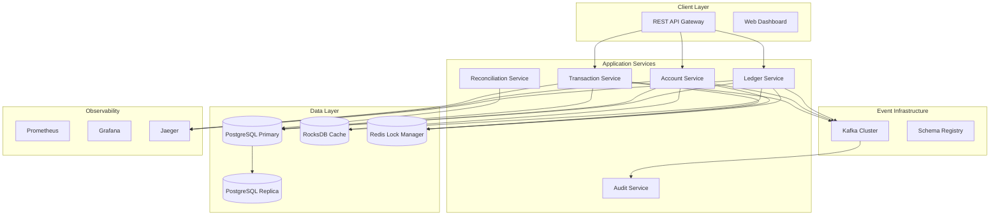

# Core Banking Ledger System

## Overview

A production-grade distributed ledger system implementing double-entry bookkeeping with ACID semantics, strong consistency, and comprehensive audit trails. This system simulates real-world core banking challenges including network partitions, duplicate messages, and regulatory compliance.

## Architecture



## Core Features

### ✅ Implemented Features

- [x] **Double-Entry Bookkeeping**: Every transaction creates balanced debit/credit entries
- [x] **ACID Transactions**: Full ACID compliance with 2PC for distributed operations
- [x] **Immutable Audit Trail**: Cryptographically secured with Merkle trees
- [x] **Real-time Balance Calculation**: Instant balance updates with validation
- [x] **Batch Reconciliation**: Automated discrepancy detection and reporting
- [x] **Account Hierarchy**: Chart of accounts with parent-child relationships
- [x] **Transaction Reversal**: Safe reversal and adjustment mechanisms
- [x] **Regulatory Compliance**: PCI DSS, SOX, and banking regulation support

### 🔧 Technical Implementation

- [x] **PostgreSQL Cluster**: WAL-based replication with Patroni-style HA
- [x] **Go Microservices**: High-performance services with gRPC APIs
- [x] **Kafka Event Streaming**: Reliable audit log streaming
- [x] **RocksDB Caching**: Local state management and performance optimization
- [x] **Redis Distributed Locking**: Idempotency and concurrency control
- [x] **Comprehensive Monitoring**: Prometheus metrics with Grafana dashboards
- [x] **Distributed Tracing**: Jaeger integration for request tracking

## Quick Start

### Prerequisites

- Docker & Docker Compose
- Go 1.21+
- PostgreSQL 15+
- Make

### 1. Start Infrastructure

```bash
# Start all required services
cd core-banking-ledger
docker-compose up -d

# Wait for services to be ready
./scripts/wait-for-services.sh
```

### 2. Initialize Database

```bash
# Run database migrations
./scripts/migrate-db.sh

# Load sample chart of accounts
./scripts/load-sample-data.sh
```

### 3. Start Services

```bash
# Build and start all services
make build-all
make start-all

# Or start individual services
make start-ledger-service
make start-account-service
make start-transaction-service
```

### 4. Run Tests

```bash
# Run all tests
make test-all

# Run specific test suites
make test-unit
make test-integration
make test-chaos
```

## API Examples

### Create Account

```bash
curl -X POST http://localhost:8080/api/v1/accounts \
  -H "Content-Type: application/json" \
  -d '{
    "account_code": "1001",
    "account_name": "Cash - Main Account",
    "account_type": "ASSET",
    "parent_account": "1000",
    "currency": "USD"
  }'
```

### Process Transaction

```bash
curl -X POST http://localhost:8080/api/v1/transactions \
  -H "Content-Type: application/json" \
  -d '{
    "transaction_id": "txn-001",
    "description": "Customer deposit",
    "entries": [
      {
        "account_code": "1001",
        "debit_amount": "1000.00",
        "credit_amount": "0.00"
      },
      {
        "account_code": "2001",
        "debit_amount": "0.00",
        "credit_amount": "1000.00"
      }
    ]
  }'
```

### Get Account Balance

```bash
curl http://localhost:8080/api/v1/accounts/1001/balance
```

## Test Scenarios

### Network Partition Tests

```bash
# Test split-brain prevention
./tests/chaos/network-partition.sh

# Test partial commit recovery
./tests/chaos/node-crash-during-commit.sh
```

### Consistency Tests

```bash
# Test duplicate message handling
./tests/integration/duplicate-messages.sh

# Test clock skew scenarios
./tests/integration/clock-skew.sh

# Test cross-shard transfers
./tests/integration/cross-shard-2pc.sh
```

### Performance Tests

```bash
# High-frequency transaction load test
./tests/performance/high-frequency-load.sh

# Reconciliation accuracy test
./tests/performance/reconciliation-accuracy.sh
```

## Monitoring & Observability

### Metrics Dashboard

Access Grafana at http://localhost:3000 (admin/admin)

Key metrics monitored:
- Transaction throughput (tx/sec)
- Reconciliation lag
- Orphan/unmatched transactions
- Linearizability violations
- Account balance accuracy

### Distributed Tracing

Access Jaeger at http://localhost:16686

Traces include:
- End-to-end transaction processing
- Cross-service communication
- Database operations
- Kafka message flow

### Logs

Structured JSON logs with correlation IDs:
- Application logs: `./logs/application/`
- Audit logs: `./logs/audit/`
- Error logs: `./logs/errors/`

## Security & Compliance

### Data Protection

- **Encryption at Rest**: AES-256 for sensitive data
- **Encryption in Transit**: TLS 1.3 for all communications
- **PII Masking**: Automatic masking in logs and monitoring
- **Access Control**: RBAC with JWT authentication

### Audit Trail

- **Immutable Logs**: Append-only audit trail
- **Cryptographic Integrity**: Merkle tree verification
- **Tamper Detection**: Automatic integrity checks
- **Retention Policies**: Configurable data retention

### Regulatory Compliance

- **SOX Compliance**: Financial reporting controls
- **PCI DSS**: Payment card data protection
- **Basel III**: Risk management requirements
- **GDPR**: Data privacy and protection

## Directory Structure

```
core-banking-ledger/
├── services/
│   ├── ledger-service/          # Core ledger operations
│   ├── account-service/         # Account management
│   ├── transaction-service/     # Transaction processing
│   ├── reconciliation-service/  # Batch reconciliation
│   └── audit-service/          # Audit trail management
├── infrastructure/
│   ├── docker-compose.yml      # Infrastructure services
│   ├── postgres/               # Database configurations
│   ├── kafka/                  # Event streaming setup
│   └── monitoring/             # Observability stack
├── tests/
│   ├── unit/                   # Unit tests
│   ├── integration/            # Integration tests
│   ├── chaos/                  # Chaos engineering tests
│   └── performance/            # Load and performance tests
├── scripts/                    # Automation scripts
├── docs/                       # Documentation
└── Makefile                    # Build automation
```

## Next Steps

1. **Enhanced Security**: Implement HSM integration for key management
2. **Multi-Region**: Add cross-region replication and disaster recovery
3. **Advanced Analytics**: Real-time fraud detection and risk scoring
4. **API Gateway**: Add rate limiting, authentication, and API versioning
5. **Mobile SDK**: Client libraries for mobile applications

## Contributing

See [CONTRIBUTING.md](./CONTRIBUTING.md) for development guidelines.

## License

MIT License - see [LICENSE](./LICENSE) for details.
