# Custody & Key-Management System

## Overview

A comprehensive digital asset custody and key management system that provides institutional-grade security for cryptocurrency and digital asset storage. This system simulates modern custody solutions used by banks, exchanges, and institutional investors, featuring multi-party computation (MPC), hardware security modules (HSM), cold/hot wallet management, and regulatory compliance.

## Architecture

```mermaid
graph TB
    subgraph "Key Generation & Management"
        KEY_GEN[Key Generator]
        MPC_ENGINE[MPC Engine]
        HSM_CLUSTER[HSM Cluster]
        KEY_VAULT[Key Vault]
    end
    
    subgraph "Wallet Management"
        HOT_WALLETS[Hot Wallets]
        WARM_WALLETS[Warm Wallets]
        COLD_STORAGE[Cold Storage]
        MULTI_SIG[Multi-Signature]
    end
    
    subgraph "Transaction Processing"
        TX_BUILDER[Transaction Builder]
        SIGNING_SERVICE[Signing Service]
        BROADCAST[Broadcast Service]
        CONFIRMATION[Confirmation Tracker]
    end
    
    subgraph "Security & Compliance"
        ACCESS_CONTROL[Access Control]
        AUDIT_LOG[Audit Logging]
        COMPLIANCE[Compliance Engine]
        RISK_CONTROLS[Risk Controls]
    end
    
    subgraph "Multi-Party Approval"
        APPROVAL_WORKFLOW[Approval Workflow]
        QUORUM_MANAGER[Quorum Manager]
        NOTIFICATION[Notification Service]
        ESCALATION[Escalation Manager]
    end
    
    subgraph "Monitoring & Analytics"
        BALANCE_MONITOR[Balance Monitor]
        SECURITY_MONITOR[Security Monitor]
        REPORTING[Reporting Service]
        DASHBOARDS[Admin Dashboard]
    end
    
    KEY_GEN --> MPC_ENGINE
    MPC_ENGINE --> HSM_CLUSTER
    HSM_CLUSTER --> KEY_VAULT
    
    KEY_VAULT --> HOT_WALLETS
    KEY_VAULT --> WARM_WALLETS
    KEY_VAULT --> COLD_STORAGE
    HOT_WALLETS --> MULTI_SIG
    
    TX_BUILDER --> SIGNING_SERVICE
    SIGNING_SERVICE --> HSM_CLUSTER
    SIGNING_SERVICE --> BROADCAST
    BROADCAST --> CONFIRMATION
    
    ACCESS_CONTROL --> AUDIT_LOG
    AUDIT_LOG --> COMPLIANCE
    COMPLIANCE --> RISK_CONTROLS
    
    APPROVAL_WORKFLOW --> QUORUM_MANAGER
    QUORUM_MANAGER --> NOTIFICATION
    NOTIFICATION --> ESCALATION
    
    BALANCE_MONITOR --> SECURITY_MONITOR
    SECURITY_MONITOR --> REPORTING
    REPORTING --> DASHBOARDS
```



## Core Features

### ✅ Implemented Features

- [x] **Multi-Party Computation (MPC)**: Distributed key generation and signing
- [x] **Hardware Security Modules**: HSM integration for key protection
- [x] **Multi-Signature Wallets**: Configurable M-of-N signature schemes
- [x] **Cold Storage Management**: Air-gapped cold wallet operations
- [x] **Hot Wallet Operations**: Real-time transaction processing
- [x] **Approval Workflows**: Multi-party transaction approval
- [x] **Risk Controls**: Transaction limits and velocity controls
- [x] **Audit Logging**: Comprehensive audit trail with tamper evidence

### 🔧 Technical Implementation

- [x] **Threshold Cryptography**: Shamir's Secret Sharing for key distribution
- [x] **BIP32/BIP44**: Hierarchical deterministic wallet support
- [x] **Multi-Blockchain**: Bitcoin, Ethereum, and ERC-20 token support
- [x] **HSM Integration**: PKCS#11 interface for hardware security
- [x] **Zero-Knowledge Proofs**: Privacy-preserving transaction validation
- [x] **Secure Enclaves**: Intel SGX for secure computation
- [x] **Quantum-Resistant**: Post-quantum cryptographic algorithms

## Quick Start

### Prerequisites

- Hardware Security Module (HSM) or simulator
- Docker & Docker Compose
- Go 1.21+ for core services
- Python 3.9+ for cryptographic operations
- Node.js 18+ for web interface
- PostgreSQL 15+ for secure data storage

### 1. Setup HSM Environment

```bash
# Install SoftHSM for development/testing
sudo apt-get install softhsm2

# Initialize HSM token
softhsm2-util --init-token --slot 0 --label "custody-token" --pin 1234 --so-pin 5678

# Verify HSM setup
pkcs11-tool --module /usr/lib/softhsm/libsofthsm2.so --list-slots
```

### 2. Start Infrastructure

```bash
# Start all required services
cd custody-key-management-system
docker-compose up -d

# Wait for services to be ready
./scripts/wait-for-services.sh
```

### 3. Initialize Key Management

```bash
# Setup master keys and key derivation
./scripts/setup-key-management.sh

# Initialize MPC threshold scheme
./scripts/setup-mpc-keys.sh

# Create initial wallets
./scripts/create-wallets.sh
```

### 4. Start Custody Services

```bash
# Build and start all services
make build-all
make start-all

# Verify system health
make health-check
```

### 5. Setup Multi-Party Approval

```bash
# Configure approval workflows
./scripts/setup-approval-workflows.sh

# Create admin users and roles
./scripts/setup-users.sh

# Test approval process
make test-approval-workflow
```

## API Examples

### Create New Wallet

```bash
curl -X POST https://localhost:8501/api/v1/wallets \
  -H "Content-Type: application/json" \
  -H "Authorization: Bearer $API_TOKEN" \
  -d '{
    "wallet_type": "MULTI_SIG",
    "blockchain": "ETHEREUM",
    "threshold": 2,
    "total_signers": 3,
    "wallet_name": "Treasury Wallet",
    "description": "Main treasury multi-sig wallet"
  }'
```

### Generate Address

```bash
curl -X POST https://localhost:8501/api/v1/wallets/WALLET_ID/addresses \
  -H "Content-Type: application/json" \
  -H "Authorization: Bearer $API_TOKEN" \
  -d '{
    "address_type": "RECEIVING",
    "derivation_path": "m/44/60/0/0/1"
  }'
```

### Create Transaction

```bash
curl -X POST https://localhost:8502/api/v1/transactions \
  -H "Content-Type: application/json" \
  -H "Authorization: Bearer $API_TOKEN" \
  -d '{
    "wallet_id": "WALLET_ID",
    "to_address": "0x742d35Cc6634C0532925a3b8D4C9db96C4b4d8b6",
    "amount": "1.5",
    "asset": "ETH",
    "priority": "HIGH",
    "memo": "Treasury disbursement"
  }'
```

### Sign Transaction

```bash
curl -X POST https://localhost:8503/api/v1/transactions/TX_ID/sign \
  -H "Content-Type: application/json" \
  -H "Authorization: Bearer $API_TOKEN" \
  -d '{
    "signer_id": "SIGNER_001",
    "signature_method": "MPC",
    "approval_code": "123456"
  }'
```

### Get Wallet Balance

```bash
curl https://localhost:8501/api/v1/wallets/WALLET_ID/balance \
  -H "Authorization: Bearer $API_TOKEN"
```

### Approve Transaction

```bash
curl -X POST https://localhost:8504/api/v1/approvals/TX_ID \
  -H "Content-Type: application/json" \
  -H "Authorization: Bearer $API_TOKEN" \
  -d '{
    "approver_id": "APPROVER_001",
    "action": "APPROVE",
    "comments": "Approved for treasury operations"
  }'
```

## Test Scenarios

### Key Management Tests

```bash
# Test key generation and derivation
./tests/keys/test-key-generation.sh

# Test MPC key sharing
./tests/keys/test-mpc-keys.sh

# Test HSM integration
./tests/keys/test-hsm-integration.sh
```

### Wallet Operations Tests

```bash
# Test wallet creation and management
./tests/wallets/test-wallet-operations.sh

# Test multi-signature functionality
./tests/wallets/test-multisig.sh

# Test cold storage operations
./tests/wallets/test-cold-storage.sh
```

### Transaction Processing Tests

```bash
# Test transaction creation and signing
./tests/transactions/test-transaction-flow.sh

# Test approval workflows
./tests/transactions/test-approval-workflow.sh

# Test broadcast and confirmation
./tests/transactions/test-broadcast.sh
```

### Security Tests

```bash
# Test access controls
./tests/security/test-access-control.sh

# Test audit logging
./tests/security/test-audit-logging.sh

# Test risk controls
./tests/security/test-risk-controls.sh
```

### Compliance Tests

```bash
# Test regulatory reporting
./tests/compliance/test-reporting.sh

# Test transaction monitoring
./tests/compliance/test-monitoring.sh

# Test data retention
./tests/compliance/test-data-retention.sh
```

## Performance Metrics

### Security Targets

- **Key Generation**: <5 seconds for 2048-bit keys
- **MPC Signing**: <10 seconds for threshold signatures
- **HSM Operations**: <1 second for cryptographic operations
- **Transaction Validation**: <500 milliseconds
- **Approval Processing**: <2 seconds
- **Audit Log Write**: <100 milliseconds

### Throughput Targets

- **Transaction Processing**: 1000+ transactions/hour
- **Key Operations**: 100+ key operations/minute
- **Signature Generation**: 500+ signatures/minute
- **Balance Updates**: 10,000+ updates/minute
- **Audit Events**: 50,000+ events/minute

### Availability Targets

- **System Uptime**: 99.99% availability
- **HSM Availability**: 99.95% availability
- **Cold Storage Access**: 99.9% availability
- **Hot Wallet Operations**: 99.99% availability
- **Approval System**: 99.95% availability

## Monitoring & Observability

### Custody Dashboard

Access the custody dashboard at https://localhost:3008 (admin/custody_admin)

Key metrics monitored:
- Wallet balances and asset allocation
- Transaction status and approval queues
- Key management operations
- Security events and alerts
- HSM status and performance
- Compliance metrics and reporting

### Security Monitoring

Access security monitoring at http://localhost:8505

Security metrics include:
- Failed authentication attempts
- Unauthorized access attempts
- Key usage patterns
- Transaction anomalies
- System integrity checks
- Threat detection alerts

### Compliance Reporting

Access compliance reports at http://localhost:8506

Compliance features include:
- Regulatory transaction reporting
- AML/KYC compliance checks
- Audit trail generation
- Data retention management
- Privacy compliance (GDPR)
- Regulatory change management

## Security & Compliance

### Cryptographic Security

- **Key Generation**: FIPS 140-2 Level 3 compliant
- **Encryption**: AES-256-GCM for data at rest
- **Transport Security**: TLS 1.3 with perfect forward secrecy
- **Digital Signatures**: ECDSA with secp256k1 and Ed25519
- **Hash Functions**: SHA-256 and SHA-3 for integrity
- **Random Number Generation**: Hardware-based entropy

### Access Control

- **Multi-Factor Authentication**: TOTP, FIDO2, and biometric
- **Role-Based Access Control**: Granular permission system
- **Privileged Access Management**: Just-in-time access
- **Session Management**: Secure session handling
- **API Security**: OAuth 2.0 and JWT tokens
- **Network Security**: Zero-trust network architecture

### Regulatory Compliance

- **SOC 2 Type II**: Security and availability controls
- **ISO 27001**: Information security management
- **FIPS 140-2**: Cryptographic module validation
- **Common Criteria**: Security evaluation standard
- **PCI DSS**: Payment card industry compliance
- **GDPR**: Data protection and privacy

### Audit & Monitoring

- **Immutable Audit Logs**: Blockchain-based audit trail
- **Real-time Monitoring**: 24/7 security monitoring
- **Incident Response**: Automated incident handling
- **Forensic Capabilities**: Digital forensics support
- **Compliance Reporting**: Automated regulatory reporting
- **Penetration Testing**: Regular security assessments

## Directory Structure

```
custody-key-management-system/
├── services/
│   ├── wallet-manager/        # Wallet management service (Go)
│   ├── transaction-service/   # Transaction processing (Go)
│   ├── signing-service/       # Cryptographic signing (Go)
│   ├── approval-service/      # Multi-party approval (Go)
│   ├── key-manager/          # Key management service (Go)
│   ├── hsm-service/          # HSM integration (C++)
│   ├── mpc-service/          # Multi-party computation (Python)
│   └── compliance-service/   # Compliance and reporting (Java)
├── crypto/
│   ├── mpc/                  # MPC implementations
│   ├── threshold/            # Threshold cryptography
│   ├── zkp/                  # Zero-knowledge proofs
│   └── post-quantum/         # Post-quantum algorithms
├── infrastructure/
│   ├── docker-compose.yml    # Infrastructure services
│   ├── hsm/                  # HSM configuration
│   ├── postgres/             # Database setup
│   └── monitoring/           # Observability stack
├── tests/
│   ├── keys/                 # Key management tests
│   ├── wallets/              # Wallet operation tests
│   ├── transactions/         # Transaction processing tests
│   ├── security/             # Security tests
│   └── compliance/           # Compliance tests
├── scripts/                  # Automation and setup scripts
├── docs/                     # Technical documentation
└── Makefile                  # Build and deployment automation
```

## Supported Blockchains

### Layer 1 Blockchains

- **Bitcoin**: Native Bitcoin support with SegWit
- **Ethereum**: Full Ethereum support with EIP-1559
- **Litecoin**: Litecoin network support
- **Bitcoin Cash**: Bitcoin Cash protocol support
- **Cardano**: Cardano blockchain integration
- **Solana**: Solana network support

### Layer 2 Solutions

- **Lightning Network**: Bitcoin Lightning Network
- **Polygon**: Ethereum Layer 2 scaling
- **Arbitrum**: Optimistic rollup support
- **Optimism**: Ethereum Layer 2 solution
- **Starknet**: ZK-rollup integration
- **Immutable X**: NFT-focused Layer 2

### Token Standards

- **ERC-20**: Ethereum fungible tokens
- **ERC-721**: Ethereum NFTs
- **ERC-1155**: Multi-token standard
- **BEP-20**: Binance Smart Chain tokens
- **SPL**: Solana Program Library tokens
- **TRC-20**: TRON network tokens

## Advanced Features

### Multi-Party Computation

- **Threshold Signatures**: t-of-n signature schemes
- **Distributed Key Generation**: Secure key generation
- **Key Refresh**: Proactive key rotation
- **Verifiable Secret Sharing**: Cryptographic verification
- **Secure Multi-Party Computation**: Privacy-preserving computation
- **Homomorphic Encryption**: Computation on encrypted data

### Hardware Security

- **HSM Integration**: PKCS#11 and proprietary APIs
- **Secure Enclaves**: Intel SGX and ARM TrustZone
- **Hardware Wallets**: Ledger and Trezor integration
- **Smart Cards**: FIDO2 and PIV card support
- **Biometric Authentication**: Fingerprint and facial recognition
- **Hardware Tokens**: OATH and FIDO tokens

### Risk Management

- **Transaction Limits**: Daily, monthly, and per-transaction limits
- **Velocity Controls**: Rate limiting and anomaly detection
- **Geolocation Restrictions**: Location-based access control
- **Time-based Controls**: Time windows for operations
- **Behavioral Analysis**: User behavior monitoring
- **Fraud Detection**: Machine learning-based fraud detection

## Next Steps

1. **Quantum Resistance**: Post-quantum cryptographic migration
2. **DeFi Integration**: Decentralized finance protocol support
3. **Cross-Chain**: Atomic swaps and cross-chain bridges
4. **Institutional Features**: Prime brokerage and lending
5. **Regulatory Technology**: Automated compliance reporting

## Contributing

See [CONTRIBUTING.md](./CONTRIBUTING.md) for development guidelines.

## License

MIT License - see [LICENSE](./LICENSE) for details.
