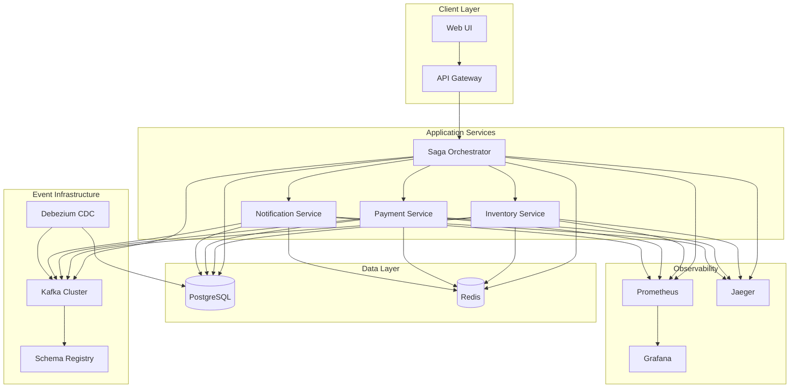

# Microservices Saga Architecture

## Overview

This project implements a comprehensive microservices architecture using the Saga pattern for distributed transaction management. The system demonstrates advanced patterns including event sourcing, CQRS, outbox pattern, and distributed tracing.

## Architecture Diagram



## Core Components

### 1. Saga Orchestrator

**Responsibilities:**
- Orchestrates distributed transactions across services
- Manages saga state and step execution
- Handles compensation logic for failed transactions
- Implements timeout and retry mechanisms
- Publishes saga lifecycle events

**Key Features:**
- Orchestration-based saga pattern
- Transactional outbox for reliable event publishing
- Idempotency handling with Redis
- Distributed tracing integration
- Comprehensive metrics collection

**API Endpoints:**
- `POST /api/v1/sagas` - Create new saga
- `GET /api/v1/sagas/{id}` - Get saga details
- `GET /api/v1/sagas` - List sagas with pagination
- `POST /api/v1/sagas/{id}/compensate` - Trigger compensation
- `POST /api/v1/sagas/{id}/retry` - Retry failed saga

### 2. Business Services

#### Inventory Service
- Manages product inventory and reservations
- Implements optimistic locking for concurrent updates
- Supports time-based reservations with TTL
- Publishes inventory events (reserved, released, updated)

#### Payment Service
- Processes payments and refunds
- Integrates with external payment providers
- Implements idempotency for payment operations
- Supports multiple payment methods

#### Notification Service
- Sends notifications via multiple channels (email, SMS, push)
- Implements retry logic with exponential backoff
- Supports notification templates and personalization
- Tracks delivery status and metrics

### 3. Event Infrastructure

#### Kafka Cluster
- **Topics:**
  - `saga-events` - Saga lifecycle events
  - `inventory-events` - Inventory operations
  - `payment-events` - Payment operations
  - `notification-events` - Notification operations

#### Schema Registry
- Manages Avro schemas for all events
- Enforces schema evolution compatibility
- Provides schema versioning and validation

#### Debezium CDC
- Captures database changes for outbox events
- Ensures exactly-once delivery semantics
- Provides at-least-once processing guarantees

## Design Patterns

### 1. Saga Pattern (Orchestration)

The system uses orchestration-based saga pattern where the Saga Orchestrator coordinates the entire transaction:

```
Order Processing Saga:
1. Reserve Inventory
2. Process Payment
3. Send Confirmation
4. Complete Order

Compensation Flow:
1. Release Inventory
2. Refund Payment
3. Send Cancellation Notice
```

**Benefits:**
- Centralized coordination logic
- Clear transaction boundaries
- Easier debugging and monitoring
- Consistent error handling

### 2. Outbox Pattern

Each service uses the transactional outbox pattern to ensure reliable event publishing:

1. Business operation and event creation in same transaction
2. Background processor publishes events to Kafka
3. Debezium CDC provides additional reliability layer
4. Idempotency keys prevent duplicate processing

### 3. Event Sourcing

Events are the source of truth for saga state:
- All state changes captured as events
- Complete audit trail of saga execution
- Ability to replay and debug transactions
- Support for temporal queries

### 4. CQRS (Command Query Responsibility Segregation)

Separate models for commands and queries:
- Commands modify state through sagas
- Queries use optimized read models
- Event-driven view updates
- Scalable read/write operations

## Data Consistency

### 1. Eventual Consistency

The system embraces eventual consistency:
- Services maintain local consistency
- Cross-service consistency achieved through sagas
- Compensation ensures business invariants
- Monitoring detects consistency violations

### 2. Idempotency

All operations are idempotent:
- Redis-based idempotency key storage
- Duplicate detection at service boundaries
- Safe retry mechanisms
- Consistent results for repeated operations

### 3. Optimistic Locking

Database entities use version-based optimistic locking:
- Prevents lost updates in concurrent scenarios
- Automatic retry for version conflicts
- Maintains data integrity without blocking

## Observability

### 1. Distributed Tracing

OpenTelemetry integration provides:
- End-to-end request tracing
- Service dependency mapping
- Performance bottleneck identification
- Error correlation across services

### 2. Metrics

Comprehensive Prometheus metrics:
- Business metrics (saga completion rates, processing times)
- Technical metrics (HTTP requests, database queries)
- Infrastructure metrics (CPU, memory, disk)
- Custom SLI/SLO tracking

### 3. Logging

Structured logging with correlation:
- JSON-formatted logs
- Correlation ID propagation
- Centralized log aggregation
- Error tracking and alerting

## Resilience Patterns

### 1. Circuit Breaker

Prevents cascade failures:
- Automatic failure detection
- Fast-fail for unhealthy services
- Gradual recovery mechanisms
- Configurable thresholds

### 2. Retry with Backoff

Handles transient failures:
- Exponential backoff strategy
- Maximum retry limits
- Jitter to prevent thundering herd
- Dead letter queues for failed messages

### 3. Timeout Handling

Prevents resource exhaustion:
- Request-level timeouts
- Saga-level timeouts
- Graceful degradation
- Timeout-based compensation

### 4. Bulkhead Pattern

Isolates critical resources:
- Separate thread pools
- Resource quotas
- Service isolation
- Failure containment

## Security

### 1. Authentication & Authorization

- JWT-based authentication
- Role-based access control (RBAC)
- Service-to-service authentication
- API key management

### 2. Data Protection

- Encryption at rest and in transit
- PII data masking in logs
- Secure credential management
- Audit logging

### 3. Network Security

- Service mesh with mTLS
- Network policies
- API rate limiting
- DDoS protection

## Deployment Architecture

### 1. Containerization

- Docker containers for all services
- Multi-stage builds for optimization
- Health checks and readiness probes
- Resource limits and requests

### 2. Orchestration

- Kubernetes for container orchestration
- StatefulSets for stateful services
- Services and Ingress for networking
- ConfigMaps and Secrets for configuration

### 3. CI/CD Pipeline

- Automated testing (unit, integration, contract)
- Security scanning
- Automated deployments
- Blue-green deployment strategy

## Monitoring & Alerting

### 1. SLIs (Service Level Indicators)

- Request success rate (>99.9%)
- Request latency (p95 < 500ms)
- Saga completion rate (>99.5%)
- System availability (>99.95%)

### 2. Alerting Rules

- High error rates
- Increased latency
- Saga failures
- Infrastructure issues

### 3. Dashboards

- Business metrics dashboard
- Technical metrics dashboard
- Infrastructure dashboard
- SLO tracking dashboard

## Scalability

### 1. Horizontal Scaling

- Stateless service design
- Load balancing
- Auto-scaling based on metrics
- Database read replicas

### 2. Performance Optimization

- Connection pooling
- Caching strategies
- Async processing
- Batch operations

### 3. Capacity Planning

- Resource monitoring
- Growth projections
- Performance testing
- Bottleneck identification

## Testing Strategy

### 1. Unit Testing

- Service logic testing
- Mock external dependencies
- High code coverage (>80%)
- Fast feedback loop

### 2. Integration Testing

- Service integration testing
- Database integration
- Message queue integration
- End-to-end scenarios

### 3. Contract Testing

- API contract validation
- Schema compatibility testing
- Consumer-driven contracts
- Breaking change detection

### 4. Chaos Testing

- Service failure scenarios
- Network partition testing
- Database failure recovery
- Load testing under failure

## Future Enhancements

### 1. Advanced Patterns

- Choreography-based sagas
- Event streaming with Kafka Streams
- CQRS with event store
- Polyglot persistence

### 2. Operational Improvements

- GitOps deployment
- Service mesh adoption
- Advanced monitoring
- ML-based anomaly detection

### 3. Business Features

- Multi-tenant support
- Advanced workflow engine
- Real-time analytics
- A/B testing framework
