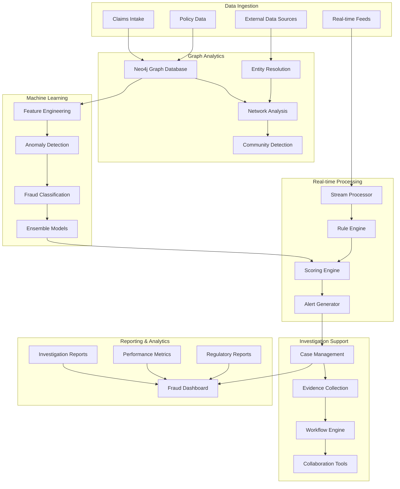

# Fraud Detection for Insurance/Claims System

## Overview

A comprehensive fraud detection system specifically designed for insurance and claims processing, utilizing graph analytics, machine learning, and real-time streaming to identify fraudulent patterns, suspicious networks, and anomalous claim behaviors. This system simulates modern insurance fraud detection platforms used by major insurers to combat organized fraud rings, staged accidents, and synthetic identity fraud.

## Architecture



## Core Features

### ✅ Implemented Features

- [x] **Graph-based Fraud Detection**: Network analysis of claim relationships
- [x] **Machine Learning Models**: Ensemble models for fraud classification
- [x] **Real-time Scoring**: Sub-second fraud risk assessment
- [x] **Entity Resolution**: Identity matching across data sources
- [x] **Network Analysis**: Community detection and suspicious patterns
- [x] **Case Management**: Investigation workflow and evidence tracking
- [x] **Regulatory Compliance**: SIU reporting and audit trails
- [x] **Performance Analytics**: Model performance and fraud metrics

### 🔧 Technical Implementation

- [x] **Graph Database**: Neo4j for relationship analysis
- [x] **Stream Processing**: Apache Kafka for real-time claim processing
- [x] **Machine Learning**: TensorFlow/PyTorch for fraud models
- [x] **Feature Store**: Centralized feature management
- [x] **Model Registry**: MLflow for model versioning
- [x] **Search Engine**: Elasticsearch for investigation support
- [x] **Time-series Analytics**: InfluxDB for fraud metrics
- [x] **Workflow Engine**: Camunda for investigation processes

## Quick Start

### Prerequisites

- Docker & Docker Compose
- Python 3.9+ for ML models
- Java 17+ for Kafka and workflow engine
- Go 1.21+ for core services
- Neo4j 5.0+ for graph analytics

### 1. Start Infrastructure

```bash
# Start all required services
cd fraud-detection-insurance
docker-compose up -d

# Wait for services to be ready
./scripts/wait-for-services.sh
```

### 2. Initialize Graph Database

```bash
# Setup Neo4j graph schema
./scripts/setup-graph-schema.sh

# Load sample insurance data
./scripts/load-sample-data.sh

# Create graph indexes for performance
./scripts/create-graph-indexes.sh
```

### 3. Train ML Models

```bash
# Setup feature store
./scripts/setup-feature-store.sh

# Train fraud detection models
./scripts/train-models.sh

# Deploy models to production
./scripts/deploy-models.sh
```

### 4. Start Fraud Detection Services

```bash
# Build and start all services
make build-all
make start-all

# Verify system health
make health-check
```

### 5. Process Sample Claims

```bash
# Generate sample claims
./scripts/generate-sample-claims.sh

# Process claims through fraud detection
make process-claims

# View fraud alerts and investigations
make view-dashboard
```

## API Examples

### Submit Insurance Claim

```bash
curl -X POST https://localhost:8521/api/v1/claims \
  -H "Content-Type: application/json" \
  -H "Authorization: Bearer $API_TOKEN" \
  -d '{
    "claim_id": "CLM001",
    "policy_number": "POL123456",
    "claimant_id": "CLMT001",
    "incident_date": "2024-01-15T14:30:00Z",
    "claim_type": "AUTO_ACCIDENT",
    "claim_amount": "15000.00",
    "location": {
      "latitude": 40.7128,
      "longitude": -74.0060,
      "address": "123 Main St, New York, NY"
    },
    "description": "Rear-end collision at intersection"
  }'
```

### Get Fraud Risk Score

```bash
curl https://localhost:8522/api/v1/fraud-score/CLM001 \
  -H "Authorization: Bearer $API_TOKEN"
```

### Analyze Claim Network

```bash
curl -X POST https://localhost:8523/api/v1/network-analysis \
  -H "Content-Type: application/json" \
  -H "Authorization: Bearer $API_TOKEN" \
  -d '{
    "claim_id": "CLM001",
    "analysis_type": "SUSPICIOUS_CONNECTIONS",
    "depth": 3
  }'
```

### Create Investigation Case

```bash
curl -X POST https://localhost:8524/api/v1/investigations \
  -H "Content-Type: application/json" \
  -H "Authorization: Bearer $API_TOKEN" \
  -d '{
    "claim_ids": ["CLM001", "CLM002"],
    "investigation_type": "ORGANIZED_FRAUD",
    "priority": "HIGH",
    "assigned_investigator": "INV001",
    "reason": "Suspicious network connections detected"
  }'
```

### Search Similar Claims

```bash
curl -X POST https://localhost:8525/api/v1/search/similar-claims \
  -H "Content-Type: application/json" \
  -H "Authorization: Bearer $API_TOKEN" \
  -d '{
    "claim_id": "CLM001",
    "similarity_threshold": 0.8,
    "search_criteria": ["location", "claimant", "incident_type"]
  }'
```

### Generate Fraud Report

```bash
curl -X POST https://localhost:8526/api/v1/reports/fraud-summary \
  -H "Content-Type: application/json" \
  -H "Authorization: Bearer $API_TOKEN" \
  -d '{
    "start_date": "2024-01-01",
    "end_date": "2024-01-31",
    "report_type": "SIU_MONTHLY",
    "include_metrics": true
  }'
```

## Test Scenarios

### Graph Analytics Tests

```bash
# Test network analysis algorithms
./tests/graph/test-network-analysis.sh

# Test community detection
./tests/graph/test-community-detection.sh

# Test entity resolution
./tests/graph/test-entity-resolution.sh
```

### Machine Learning Tests

```bash
# Test fraud classification models
./tests/ml/test-fraud-classification.sh

# Test anomaly detection
./tests/ml/test-anomaly-detection.sh

# Test model performance
./tests/ml/test-model-performance.sh
```

### Real-time Processing Tests

```bash
# Test stream processing performance
./tests/streaming/test-stream-processing.sh

# Test real-time scoring
./tests/streaming/test-real-time-scoring.sh

# Test alert generation
./tests/streaming/test-alert-generation.sh
```

### Investigation Workflow Tests

```bash
# Test case management
./tests/investigation/test-case-management.sh

# Test workflow automation
./tests/investigation/test-workflow-automation.sh

# Test evidence collection
./tests/investigation/test-evidence-collection.sh
```

### Performance Tests

```bash
# Test high-volume claim processing
./tests/performance/test-claim-throughput.sh

# Test graph query performance
./tests/performance/test-graph-performance.sh

# Test ML inference latency
./tests/performance/test-ml-latency.sh
```

## Performance Metrics

### Processing Targets

- **Claim Ingestion**: 10,000+ claims/hour
- **Fraud Scoring**: <500ms per claim
- **Graph Analysis**: <2 seconds for network analysis
- **ML Inference**: <100ms for fraud classification
- **Alert Generation**: <1 second from detection
- **Investigation Creation**: <5 seconds

### Detection Targets

- **Fraud Detection Rate**: >95% true positive rate
- **False Positive Rate**: <5% for high-priority alerts
- **Network Detection**: Identify 90%+ of fraud rings
- **Anomaly Detection**: 99%+ accuracy for known patterns
- **Entity Resolution**: 98%+ accuracy for identity matching

### Availability Targets

- **System Uptime**: 99.9% availability
- **Real-time Processing**: 99.95% success rate
- **Graph Database**: 99.9% query success rate
- **ML Model Serving**: 99.95% inference success
- **Investigation System**: 99.9% availability

## Monitoring & Observability

### Fraud Detection Dashboard

Access the fraud dashboard at https://localhost:3010 (admin/fraud_admin)

Key metrics monitored:
- Real-time fraud alerts and risk scores
- Investigation case status and workflow
- Network analysis and suspicious patterns
- ML model performance and accuracy
- Claim processing rates and latencies
- Investigator workload and productivity

### Investigation Analytics

Access investigation analytics at http://localhost:8527

Analytics include:
- Fraud pattern analysis and trends
- Network visualization and community detection
- Investigation outcome tracking
- Model performance metrics
- Regulatory compliance reporting
- Cost savings and ROI analysis

### Performance Monitoring

Access performance monitoring at http://localhost:8528

Performance metrics include:
- Claim processing throughput
- Graph query performance
- ML inference latency
- Alert generation rates
- System resource utilization
- Data quality metrics

## Security & Compliance

### Data Security

- **Encryption**: AES-256 for PII and sensitive claim data
- **Access Control**: Role-based access with audit logging
- **Data Masking**: PII protection in non-production environments
- **Secure APIs**: OAuth 2.0 and JWT token authentication
- **Network Security**: TLS 1.3 with certificate pinning
- **Database Security**: Encrypted connections and field-level encryption

### Regulatory Compliance

- **NAIC Guidelines**: National Association of Insurance Commissioners
- **SIU Reporting**: Special Investigation Unit compliance
- **Privacy Laws**: GDPR, CCPA, and state privacy regulations
- **Data Retention**: Automated retention policy enforcement
- **Audit Trails**: Complete investigation audit logs
- **Regulatory Reporting**: Automated fraud statistics reporting

### Investigation Compliance

- **Chain of Custody**: Digital evidence management
- **Investigation Standards**: SIU best practices compliance
- **Legal Hold**: Automated legal hold processes
- **Disclosure Requirements**: Regulatory disclosure automation
- **Quality Assurance**: Investigation quality metrics
- **Training Compliance**: Investigator certification tracking

## Directory Structure

```
fraud-detection-insurance/
├── services/
│   ├── claim-processor/       # Claim ingestion and processing (Go)
│   ├── fraud-scorer/          # Real-time fraud scoring (Python)
│   ├── graph-analyzer/        # Graph analytics service (Python)
│   ├── ml-inference/          # ML model serving (Python)
│   ├── investigation-mgmt/    # Case management (Java)
│   ├── alert-service/         # Alert generation and routing (Go)
│   ├── search-service/        # Investigation search (Go)
│   └── reporting-service/     # Fraud reporting (Go)
├── models/
│   ├── fraud-classification/  # Fraud classification models
│   ├── anomaly-detection/     # Anomaly detection models
│   ├── network-analysis/      # Graph analysis algorithms
│   └── feature-engineering/   # Feature transformation pipelines
├── graph/
│   ├── schema/                # Neo4j graph schema
│   ├── queries/               # Cypher queries
│   ├── algorithms/            # Custom graph algorithms
│   └── data-loaders/          # Graph data loading scripts
├── infrastructure/
│   ├── docker-compose.yml     # Infrastructure services
│   ├── neo4j/                 # Graph database configuration
│   ├── kafka/                 # Event streaming setup
│   ├── elasticsearch/         # Search engine configuration
│   └── monitoring/            # Observability stack
├── tests/
│   ├── graph/                 # Graph analytics tests
│   ├── ml/                    # Machine learning tests
│   ├── streaming/             # Real-time processing tests
│   ├── investigation/         # Investigation workflow tests
│   └── performance/           # Performance tests
├── scripts/                   # Automation and setup scripts
├── docs/                      # Technical documentation
└── Makefile                   # Build and deployment automation
```

## Fraud Detection Patterns

### Insurance Fraud Types

- **Staged Accidents**: Orchestrated collision schemes
- **Exaggerated Claims**: Inflated damage or injury claims
- **Phantom Providers**: Non-existent medical providers
- **Identity Theft**: Synthetic identity fraud
- **Premium Fraud**: Misrepresentation on applications
- **Workers' Compensation**: Fake injury claims

### Graph Patterns

- **Fraud Rings**: Connected networks of fraudulent actors
- **Shared Addresses**: Multiple claimants at same location
- **Common Providers**: Suspicious provider relationships
- **Temporal Clustering**: Claims clustered in time
- **Geographic Clustering**: Claims clustered by location
- **Relationship Patterns**: Unusual relationship networks

### ML Detection Models

- **Gradient Boosting**: XGBoost for fraud classification
- **Neural Networks**: Deep learning for pattern recognition
- **Isolation Forest**: Unsupervised anomaly detection
- **Graph Neural Networks**: Network-based fraud detection
- **Ensemble Methods**: Combined model predictions
- **Time Series Analysis**: Temporal pattern detection

## Advanced Features

### Graph Analytics

- **Community Detection**: Louvain algorithm for fraud rings
- **Centrality Analysis**: Identify key fraud actors
- **Path Analysis**: Trace connections between entities
- **Similarity Scoring**: Entity similarity algorithms
- **Temporal Analysis**: Time-based relationship evolution
- **Subgraph Matching**: Pattern matching in networks

### Machine Learning

- **AutoML**: Automated model selection and tuning
- **Feature Store**: Centralized feature management
- **Model Registry**: Version control for ML models
- **A/B Testing**: Model performance comparison
- **Drift Detection**: Model performance monitoring
- **Explainable AI**: Model interpretability and explanations

### Investigation Support

- **Case Prioritization**: Risk-based case ranking
- **Evidence Collection**: Automated evidence gathering
- **Workflow Automation**: Investigation process automation
- **Collaboration Tools**: Multi-investigator coordination
- **Document Management**: Investigation document storage
- **Timeline Analysis**: Event sequence reconstruction

## Next Steps

1. **Advanced AI**: Large language models for claim analysis
2. **Real-time Collaboration**: Live investigation collaboration
3. **Mobile Investigation**: Mobile apps for field investigators
4. **Blockchain Evidence**: Immutable evidence storage
5. **Predictive Analytics**: Fraud prediction and prevention

## Contributing

See [CONTRIBUTING.md](./CONTRIBUTING.md) for development guidelines.

## License

MIT License - see [LICENSE](./LICENSE) for details.
