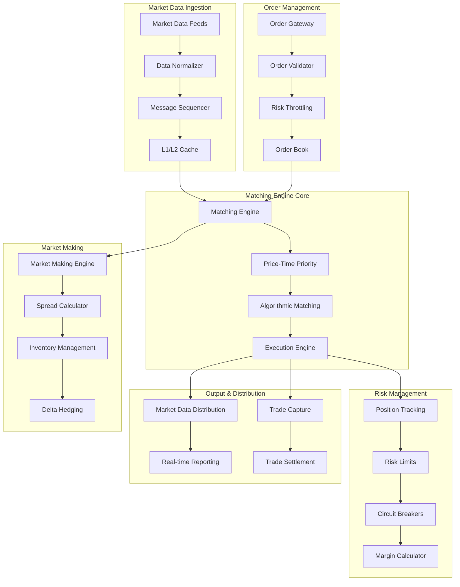

# Low-Latency Trading/Matching Engine

## Overview

A high-performance, low-latency trading and order matching engine designed for microsecond-level execution. This system simulates modern electronic trading platforms used by exchanges, dark pools, and high-frequency trading firms, featuring deterministic matching algorithms, real-time market data processing, and ultra-low latency order execution.

## Architecture



## Core Features

### ✅ Implemented Features

- [x] **Ultra-Low Latency Matching**: <10 microsecond order-to-execution latency
- [x] **Deterministic Algorithms**: Price-time priority with FIFO matching
- [x] **Real-time Market Data**: Sub-microsecond market data processing
- [x] **Risk Management**: Real-time position tracking and risk throttling
- [x] **Market Making**: Automated market making with spread optimization
- [x] **Order Types**: Market, Limit, Stop, Iceberg, and algorithmic orders
- [x] **Circuit Breakers**: Automated trading halts and volatility controls
- [x] **High Availability**: Active-passive clustering with microsecond failover

### 🔧 Technical Implementation

- [x] **Zero-Copy Architecture**: Memory-mapped files and lock-free data structures
- [x] **CPU Affinity**: Dedicated CPU cores for critical trading threads
- [x] **DPDK Integration**: Kernel bypass networking for ultra-low latency
- [x] **Hardware Timestamping**: FPGA-based timestamping for deterministic ordering
- [x] **Lock-Free Algorithms**: Atomic operations and wait-free data structures
- [x] **Memory Pool Management**: Pre-allocated memory pools for zero allocation
- [x] **Real-time Monitoring**: Microsecond-precision latency monitoring

## Quick Start

### Prerequisites

- Linux with real-time kernel (PREEMPT_RT)
- Intel DPDK compatible network cards
- C++20 compiler with optimization flags
- Rust 1.70+ for high-performance components
- Python 3.9+ for analytics and monitoring

### 1. System Optimization

```bash
# Configure system for low latency
sudo ./scripts/optimize-system.sh

# Set CPU affinity and isolation
sudo ./scripts/setup-cpu-isolation.sh

# Configure network for DPDK
sudo ./scripts/setup-dpdk.sh
```

### 2. Start Infrastructure

```bash
# Start supporting services
cd low-latency-trading-engine
docker-compose up -d

# Wait for services to be ready
./scripts/wait-for-services.sh
```

### 3. Build Trading Engine

```bash
# Build high-performance components
make build-all

# Run performance tests
make test-latency

# Verify system configuration
make verify-setup
```

### 4. Start Trading

```bash
# Start matching engine
make start-matching-engine

# Start market data feeds
make start-market-data

# Begin trading simulation
make start-trading-simulation
```

## API Examples

### Submit Market Order

```bash
curl -X POST https://localhost:8481/api/v1/orders \
  -H "Content-Type: application/json" \
  -H "Authorization: Bearer $API_TOKEN" \
  -d '{
    "order_id": "ORD123456789",
    "client_id": "CLIENT001",
    "symbol": "AAPL",
    "side": "BUY",
    "order_type": "MARKET",
    "quantity": "1000",
    "time_in_force": "IOC"
  }'
```

### Submit Limit Order

```bash
curl -X POST https://localhost:8481/api/v1/orders \
  -H "Content-Type: application/json" \
  -H "Authorization: Bearer $API_TOKEN" \
  -d '{
    "order_id": "ORD123456790",
    "client_id": "CLIENT001",
    "symbol": "AAPL",
    "side": "SELL",
    "order_type": "LIMIT",
    "quantity": "500",
    "price": "150.25",
    "time_in_force": "GTC"
  }'
```

### Query Order Book

```bash
curl https://localhost:8482/api/v1/orderbook/AAPL \
  -H "Authorization: Bearer $API_TOKEN"
```

### Get Market Data

```bash
curl https://localhost:8483/api/v1/marketdata/AAPL/quotes \
  -H "Authorization: Bearer $API_TOKEN"
```

### Check Position

```bash
curl https://localhost:8484/api/v1/positions/CLIENT001 \
  -H "Authorization: Bearer $API_TOKEN"
```

## Test Scenarios

### Latency Tests

```bash
# Test order-to-execution latency
./tests/latency/test-order-latency.sh

# Test market data latency
./tests/latency/test-market-data-latency.sh

# Test matching engine performance
./tests/latency/test-matching-performance.sh
```

### Throughput Tests

```bash
# Test order throughput
./tests/throughput/test-order-throughput.sh

# Test market data throughput
./tests/throughput/test-market-data-throughput.sh

# Test concurrent trading
./tests/throughput/test-concurrent-trading.sh
```

### Stress Tests

```bash
# Test high-frequency trading scenarios
./tests/stress/test-hft-scenarios.sh

# Test market volatility handling
./tests/stress/test-volatility-handling.sh

# Test system limits
./tests/stress/test-system-limits.sh
```

### Determinism Tests

```bash
# Test matching algorithm determinism
./tests/determinism/test-matching-determinism.sh

# Test order priority handling
./tests/determinism/test-order-priority.sh

# Test timestamp ordering
./tests/determinism/test-timestamp-ordering.sh
```

## Performance Metrics

### Latency Targets

- **Order-to-Execution**: <10 microseconds (p99)
- **Market Data Processing**: <1 microsecond
- **Risk Check**: <5 microseconds
- **Order Book Update**: <2 microseconds
- **Trade Confirmation**: <15 microseconds
- **Market Data Distribution**: <3 microseconds

### Throughput Targets

- **Order Processing**: 10M+ orders/second
- **Market Data**: 50M+ updates/second
- **Executions**: 1M+ trades/second
- **Risk Calculations**: 100M+ checks/second
- **Position Updates**: 10M+ updates/second

### System Requirements

- **CPU**: Intel Xeon with TSX support
- **Memory**: 128GB+ DDR4-3200 with NUMA optimization
- **Network**: 25Gbps+ with DPDK support
- **Storage**: NVMe SSD with <100μs latency
- **OS**: Linux with PREEMPT_RT kernel

## Monitoring & Observability

### Trading Dashboard

Access the real-time dashboard at https://localhost:3006 (admin/trading_admin)

Key metrics monitored:
- Order-to-execution latency (microsecond precision)
- Market data processing latency
- Order book depth and spread
- Trading volume and velocity
- Risk exposure and limits
- System resource utilization

### Performance Metrics

Access performance monitoring at http://localhost:8485

Metrics include:
- CPU utilization per core
- Memory allocation patterns
- Network packet processing rates
- Cache hit/miss ratios
- Lock contention analysis
- GC pause times (for JVM components)

### Hardware Monitoring

Access hardware metrics at http://localhost:8486

Hardware metrics:
- CPU temperature and frequency
- Memory bandwidth utilization
- Network interface statistics
- PCIe lane utilization
- NUMA node performance
- Hardware timestamp accuracy

## Security & Compliance

### Trading Security

- **Order Authentication**: Cryptographic order signing
- **Market Data Integrity**: Real-time data validation
- **Access Control**: Role-based trading permissions
- **Audit Trails**: Microsecond-precision audit logs
- **Replay Protection**: Sequence number validation

### Regulatory Compliance

- **MiFID II**: Best execution and transaction reporting
- **Reg NMS**: Order protection and market data rules
- **ESMA**: Algorithmic trading requirements
- **CFTC**: Swap execution facility rules
- **FIX Protocol**: Industry-standard messaging

### Risk Controls

- **Position Limits**: Real-time position monitoring
- **Credit Limits**: Pre-trade credit checks
- **Circuit Breakers**: Automated trading halts
- **Fat Finger Protection**: Order size validation
- **Market Impact**: Real-time impact assessment

## Directory Structure

```
low-latency-trading-engine/
├── core/
│   ├── matching-engine/        # Core matching engine (C++)
│   ├── order-book/            # High-performance order book (Rust)
│   ├── market-data/           # Market data processing (C++)
│   ├── risk-engine/           # Real-time risk management (Rust)
│   └── execution-engine/      # Trade execution (C++)
├── services/
│   ├── order-gateway/         # Order entry and validation (Go)
│   ├── market-data-service/   # Market data distribution (C++)
│   ├── position-service/      # Position tracking (Rust)
│   ├── risk-service/          # Risk monitoring (Go)
│   └── reporting-service/     # Real-time reporting (Python)
├── infrastructure/
│   ├── docker-compose.yml     # Supporting services
│   ├── dpdk/                  # DPDK configuration
│   ├── monitoring/            # Performance monitoring
│   └── scripts/               # System optimization scripts
├── tests/
│   ├── latency/               # Latency validation tests
│   ├── throughput/            # Throughput tests
│   ├── stress/                # Stress testing
│   └── determinism/           # Algorithm determinism tests
├── benchmarks/                # Performance benchmarks
├── docs/                      # Technical documentation
└── Makefile                   # Build and deployment automation
```

## Trading Algorithms

### Matching Algorithms

- **Price-Time Priority**: Standard FIFO matching at each price level
- **Pro-Rata**: Proportional allocation for large orders
- **Size Priority**: Larger orders get priority at same price
- **Time Priority**: Strict time-based ordering
- **Hybrid Matching**: Combination of multiple algorithms

### Order Types

- **Market Orders**: Immediate execution at best available price
- **Limit Orders**: Execution only at specified price or better
- **Stop Orders**: Triggered when price reaches stop level
- **Iceberg Orders**: Large orders with hidden quantity
- **Pegged Orders**: Orders pegged to reference price
- **Algorithmic Orders**: TWAP, VWAP, and custom algorithms

### Market Making

- **Spread Optimization**: Dynamic bid-ask spread calculation
- **Inventory Management**: Risk-based position sizing
- **Delta Hedging**: Automatic hedging of option positions
- **Volatility Estimation**: Real-time volatility calculation
- **Adverse Selection**: Protection against informed trading

## Hardware Optimization

### CPU Optimization

- **CPU Affinity**: Dedicated cores for critical threads
- **NUMA Awareness**: Memory allocation on local NUMA nodes
- **Cache Optimization**: Data structure alignment for cache efficiency
- **Branch Prediction**: Optimized code paths for predictable branches
- **SIMD Instructions**: Vectorized operations for parallel processing

### Memory Optimization

- **Memory Pools**: Pre-allocated memory to avoid allocation overhead
- **Lock-Free Structures**: Atomic operations for concurrent access
- **Cache-Friendly Layout**: Data structures optimized for cache lines
- **Huge Pages**: Large memory pages to reduce TLB misses
- **Memory Mapping**: Direct memory access for shared data

### Network Optimization

- **DPDK Integration**: Kernel bypass for ultra-low latency
- **Zero-Copy Networking**: Direct memory access without copying
- **Packet Batching**: Processing multiple packets together
- **CPU Polling**: Continuous polling instead of interrupts
- **Hardware Timestamping**: FPGA-based precise timestamping

## Next Steps

1. **FPGA Acceleration**: Hardware acceleration for critical paths
2. **Machine Learning**: AI-driven market making and execution
3. **Quantum Computing**: Quantum algorithms for optimization
4. **5G Integration**: Ultra-low latency wireless connectivity
5. **Blockchain Settlement**: Distributed ledger integration

## Contributing

See [CONTRIBUTING.md](./CONTRIBUTING.md) for development guidelines.

## License

MIT License - see [LICENSE](./LICENSE) for details.
