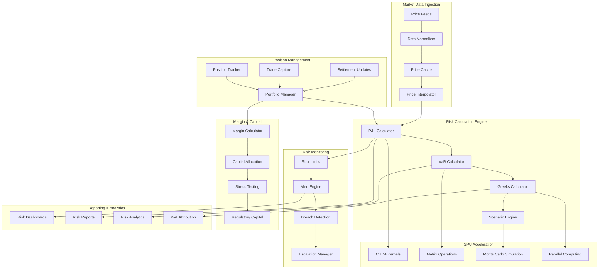

# Market Risk/Real-time Risk Engine

## Overview

A high-performance real-time market risk management system that provides continuous P&L calculation, margin monitoring, intraday risk metrics, and automated risk controls. This system simulates modern risk management platforms used by investment banks, hedge funds, and trading firms, featuring GPU-accelerated calculations, streaming price feeds, and microsecond-level risk monitoring.

## Architecture



## Core Features

### ✅ Implemented Features

- [x] **Real-time P&L Calculation**: Microsecond-level P&L updates with streaming prices
- [x] **Value-at-Risk (VaR)**: Historical, parametric, and Monte Carlo VaR models
- [x] **Greeks Calculation**: Delta, gamma, theta, vega, rho for options portfolios
- [x] **Margin Monitoring**: Real-time margin requirements and calls
- [x] **Stress Testing**: Scenario-based stress testing and sensitivity analysis
- [x] **Risk Limits**: Configurable risk limits with real-time monitoring
- [x] **GPU Acceleration**: CUDA-based parallel computing for complex calculations
- [x] **Intraday Risk Metrics**: Continuous risk monitoring throughout trading day

### 🔧 Technical Implementation

- [x] **Stream Processing**: Apache Kafka for real-time price and trade feeds
- [x] **GPU Computing**: NVIDIA CUDA for parallel risk calculations
- [x] **Time-series Database**: InfluxDB for high-frequency risk metrics storage
- [x] **In-memory Computing**: Redis for ultra-fast position and price caching
- [x] **Machine Learning**: TensorFlow for predictive risk modeling
- [x] **Event-driven Architecture**: Reactive risk monitoring and alerting
- [x] **High-frequency Updates**: Sub-millisecond risk metric updates

## Quick Start

### Prerequisites

- NVIDIA GPU with CUDA support (GTX 1060 or better)
- CUDA Toolkit 11.8+
- Docker & Docker Compose
- Python 3.9+ with CUDA libraries
- Go 1.21+ for high-performance services
- Java 17+ for enterprise components

### 1. Setup GPU Environment

```bash
# Install NVIDIA Docker runtime
sudo apt-get update
sudo apt-get install -y nvidia-docker2
sudo systemctl restart docker

# Verify GPU access
docker run --rm --gpus all nvidia/cuda:11.8-base-ubuntu20.04 nvidia-smi
```

### 2. Start Infrastructure

```bash
# Start all required services
cd market-risk-engine
docker-compose up -d

# Wait for services to be ready
./scripts/wait-for-services.sh
```

### 3. Initialize Risk Models

```bash
# Setup risk models and parameters
./scripts/setup-risk-models.sh

# Load market data and positions
./scripts/load-market-data.sh

# Initialize GPU kernels
./scripts/setup-gpu-kernels.sh
```

### 4. Start Risk Engine

```bash
# Build and start all services
make build-all
make start-all

# Verify system health
make health-check
```

### 5. Run Risk Calculations

```bash
# Start real-time risk monitoring
make start-risk-monitoring

# Generate test positions
make generate-test-positions

# View risk dashboard
make view-dashboard
```

## API Examples

### Submit Position Update

```bash
curl -X POST https://localhost:8491/api/v1/positions \
  -H "Content-Type: application/json" \
  -H "Authorization: Bearer $API_TOKEN" \
  -d '{
    "portfolio_id": "PORTFOLIO001",
    "instrument_id": "AAPL",
    "quantity": "10000",
    "average_price": "150.25",
    "market_value": "1502500.00",
    "currency": "USD",
    "timestamp": "2024-01-15T10:30:00Z"
  }'
```

### Get Real-time P&L

```bash
curl https://localhost:8491/api/v1/pnl/PORTFOLIO001 \
  -H "Authorization: Bearer $API_TOKEN"
```

### Calculate VaR

```bash
curl -X POST https://localhost:8492/api/v1/var/calculate \
  -H "Content-Type: application/json" \
  -H "Authorization: Bearer $API_TOKEN" \
  -d '{
    "portfolio_id": "PORTFOLIO001",
    "confidence_level": 0.95,
    "time_horizon": 1,
    "method": "MONTE_CARLO",
    "simulations": 100000
  }'
```

### Get Greeks

```bash
curl https://localhost:8493/api/v1/greeks/PORTFOLIO001 \
  -H "Authorization: Bearer $API_TOKEN"
```

### Check Risk Limits

```bash
curl https://localhost:8494/api/v1/limits/PORTFOLIO001/status \
  -H "Authorization: Bearer $API_TOKEN"
```

### Run Stress Test

```bash
curl -X POST https://localhost:8495/api/v1/stress-test \
  -H "Content-Type: application/json" \
  -H "Authorization: Bearer $API_TOKEN" \
  -d '{
    "portfolio_id": "PORTFOLIO001",
    "scenario": "MARKET_CRASH_2008",
    "shock_magnitude": 0.3
  }'
```

## Test Scenarios

### P&L Calculation Tests

```bash
# Test real-time P&L accuracy
./tests/pnl/test-pnl-accuracy.sh

# Test P&L attribution
./tests/pnl/test-pnl-attribution.sh

# Test intraday P&L updates
./tests/pnl/test-intraday-pnl.sh
```

### VaR Model Tests

```bash
# Test VaR model accuracy
./tests/var/test-var-models.sh

# Test backtesting framework
./tests/var/test-var-backtesting.sh

# Test Monte Carlo convergence
./tests/var/test-monte-carlo.sh
```

### Greeks Calculation Tests

```bash
# Test options Greeks accuracy
./tests/greeks/test-greeks-accuracy.sh

# Test Greeks sensitivity
./tests/greeks/test-greeks-sensitivity.sh

# Test portfolio Greeks aggregation
./tests/greeks/test-portfolio-greeks.sh
```

### GPU Performance Tests

```bash
# Test GPU acceleration performance
./tests/gpu/test-gpu-performance.sh

# Test CUDA kernel accuracy
./tests/gpu/test-cuda-kernels.sh

# Test memory management
./tests/gpu/test-gpu-memory.sh
```

### Risk Limits Tests

```bash
# Test limit monitoring
./tests/limits/test-limit-monitoring.sh

# Test breach detection
./tests/limits/test-breach-detection.sh

# Test escalation procedures
./tests/limits/test-escalation.sh
```

## Performance Metrics

### Latency Targets

- **P&L Update**: <1 millisecond
- **VaR Calculation**: <100 milliseconds (100K simulations)
- **Greeks Update**: <5 milliseconds
- **Risk Limit Check**: <500 microseconds
- **Margin Calculation**: <10 milliseconds
- **Stress Test**: <1 second (full portfolio)

### Throughput Targets

- **Position Updates**: 1M+ updates/second
- **Price Updates**: 10M+ ticks/second
- **Risk Calculations**: 100K+ calculations/second
- **VaR Simulations**: 1M+ paths/second
- **Greeks Calculations**: 500K+ instruments/second

### GPU Performance

- **CUDA Cores**: 2048+ cores utilized
- **Memory Bandwidth**: 500+ GB/s
- **Compute Utilization**: >90% during calculations
- **Memory Efficiency**: >80% bandwidth utilization
- **Parallel Speedup**: 50x+ vs CPU-only

## Monitoring & Observability

### Risk Dashboard

Access the real-time dashboard at https://localhost:3007 (admin/risk_admin)

Key metrics monitored:
- Real-time P&L by portfolio and instrument
- VaR metrics with confidence intervals
- Greeks exposure and sensitivity
- Risk limit utilization and breaches
- GPU utilization and performance
- Market data latency and quality

### Performance Metrics

Access performance monitoring at http://localhost:8496

Metrics include:
- Calculation latency percentiles
- GPU memory usage and throughput
- Market data processing rates
- Risk calculation accuracy
- System resource utilization
- Alert generation and response times

### Risk Analytics

Access risk analytics at http://localhost:8497

Analytics include:
- P&L attribution analysis
- VaR model performance
- Stress test results
- Correlation analysis
- Risk factor decomposition
- Historical risk metrics

## Security & Compliance

### Risk Security

- **Data Encryption**: AES-256 for sensitive risk data
- **Access Control**: Role-based risk management permissions
- **Audit Trails**: Complete audit logs for all risk calculations
- **Model Validation**: Independent validation of risk models
- **Data Integrity**: Cryptographic checksums for critical data

### Regulatory Compliance

- **Basel III**: Market risk capital requirements
- **FRTB**: Fundamental Review of Trading Book
- **CCAR**: Comprehensive Capital Analysis and Review
- **MiFID II**: Risk management and reporting requirements
- **EMIR**: Risk mitigation for derivatives
- **Dodd-Frank**: Volcker Rule compliance

### Model Governance

- **Model Approval**: Formal model approval process
- **Backtesting**: Regular model performance validation
- **Benchmarking**: Comparison against industry standards
- **Documentation**: Complete model documentation
- **Change Control**: Versioned model updates
- **Independent Validation**: Third-party model validation

## Directory Structure

```
market-risk-engine/
├── services/
│   ├── pnl-calculator/         # Real-time P&L calculation (Python/CUDA)
│   ├── var-engine/            # VaR calculation service (Python/GPU)
│   ├── greeks-calculator/     # Options Greeks service (C++/CUDA)
│   ├── position-manager/      # Position tracking (Go)
│   ├── risk-monitor/          # Risk monitoring and alerts (Go)
│   ├── margin-calculator/     # Margin calculation (Java)
│   ├── stress-tester/         # Stress testing engine (Python)
│   └── reporting-service/     # Risk reporting (Go)
├── gpu-kernels/
│   ├── cuda/                  # CUDA kernel implementations
│   ├── opencl/                # OpenCL kernels (alternative)
│   └── benchmarks/            # GPU performance benchmarks
├── models/
│   ├── var-models/            # VaR model implementations
│   ├── pricing-models/        # Instrument pricing models
│   ├── risk-factors/          # Risk factor models
│   └── correlation-models/    # Correlation and covariance models
├── infrastructure/
│   ├── docker-compose.yml     # Infrastructure services
│   ├── kafka/                 # Event streaming configuration
│   ├── influxdb/              # Time-series database setup
│   ├── redis/                 # In-memory caching
│   └── monitoring/            # Observability stack
├── tests/
│   ├── pnl/                   # P&L calculation tests
│   ├── var/                   # VaR model tests
│   ├── greeks/                # Greeks calculation tests
│   ├── gpu/                   # GPU performance tests
│   ├── limits/                # Risk limits tests
│   └── integration/           # End-to-end tests
├── scripts/                   # Automation and setup scripts
├── docs/                      # Technical documentation
└── Makefile                   # Build and deployment automation
```

## Risk Models

### P&L Models

- **Mark-to-Market**: Real-time market value calculation
- **Mark-to-Model**: Theoretical pricing for illiquid instruments
- **Accrual P&L**: Interest and dividend accruals
- **Realized P&L**: Actual trading gains and losses
- **Unrealized P&L**: Paper gains and losses
- **Currency P&L**: Foreign exchange impact

### VaR Models

- **Historical Simulation**: Non-parametric historical VaR
- **Parametric VaR**: Normal distribution assumption
- **Monte Carlo VaR**: Simulation-based VaR calculation
- **Expected Shortfall**: Conditional VaR beyond confidence level
- **Stressed VaR**: VaR under stressed market conditions
- **Incremental VaR**: Marginal contribution to portfolio VaR

### Greeks Models

- **Delta**: Price sensitivity to underlying asset
- **Gamma**: Delta sensitivity to underlying price
- **Theta**: Time decay sensitivity
- **Vega**: Volatility sensitivity
- **Rho**: Interest rate sensitivity
- **Higher-order Greeks**: Volga, vanna, charm, color

### Stress Testing

- **Historical Scenarios**: Replaying historical market events
- **Hypothetical Scenarios**: Custom stress scenarios
- **Monte Carlo Stress**: Simulation-based stress testing
- **Sensitivity Analysis**: Single factor stress testing
- **Correlation Breakdown**: Stress testing correlation assumptions
- **Liquidity Stress**: Impact of reduced market liquidity

## GPU Acceleration

### CUDA Implementation

- **Parallel P&L**: Simultaneous P&L calculation across instruments
- **Matrix Operations**: GPU-accelerated linear algebra
- **Monte Carlo**: Parallel random number generation and simulation
- **Greeks Calculation**: Finite difference methods on GPU
- **Risk Aggregation**: Parallel portfolio risk calculation
- **Memory Optimization**: Efficient GPU memory management

### Performance Optimization

- **Memory Coalescing**: Optimized memory access patterns
- **Shared Memory**: Efficient use of GPU shared memory
- **Occupancy Optimization**: Maximizing GPU core utilization
- **Stream Processing**: Overlapping computation and data transfer
- **Kernel Fusion**: Combining multiple operations in single kernel
- **Dynamic Parallelism**: GPU-initiated kernel launches

## Next Steps

1. **Quantum Computing**: Quantum algorithms for portfolio optimization
2. **Machine Learning**: AI-driven risk factor modeling
3. **Real-time Streaming**: Apache Flink for complex event processing
4. **Distributed Computing**: Multi-GPU and multi-node scaling
5. **Alternative Data**: Integration of non-traditional risk factors

## Contributing

See [CONTRIBUTING.md](./CONTRIBUTING.md) for development guidelines.

## License

MIT License - see [LICENSE](./LICENSE) for details.
