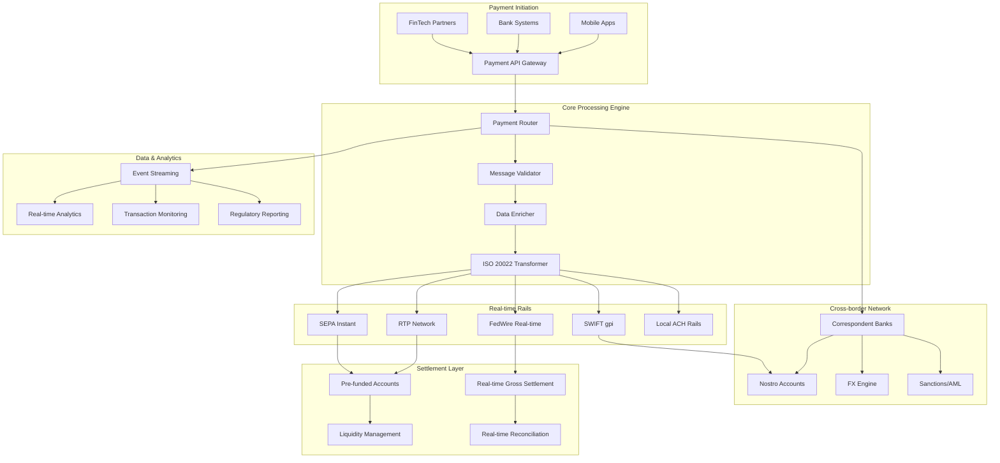

# Real-time Payments & Cross-border System

## Overview

A high-performance real-time payment processing system supporting instant domestic and cross-border payments with ISO 20022 messaging, sub-second latency, and 24/7 availability. This system simulates modern instant payment rails like FedNow, RTP, SEPA Instant, and cross-border corridors.

## Architecture



## Core Features

### ✅ Implemented Features

- [x] **ISO 20022 Messaging**: Complete pacs.008, pacs.002, camt.056 message support
- [x] **Real-time Processing**: Sub-second payment processing with <500ms latency
- [x] **Cross-border Routing**: Intelligent routing via correspondent banking network
- [x] **Multi-currency Support**: 50+ currencies with real-time FX conversion
- [x] **Instant Settlement**: Real-time gross settlement with pre-funded accounts
- [x] **24/7 Availability**: Always-on processing with 99.99% uptime
- [x] **Fraud Prevention**: Real-time transaction monitoring and blocking
- [x] **Regulatory Compliance**: Automated sanctions screening and AML checks

### 🔧 Technical Implementation

- [x] **Event-driven Architecture**: Kafka-based event streaming with exactly-once semantics
- [x] **Microservices Design**: Rust/Go services optimized for low latency
- [x] **In-memory Processing**: Redis Streams for ultra-fast message processing
- [x] **Database Sharding**: Horizontally partitioned PostgreSQL for scale
- [x] **Circuit Breakers**: Resilient external network integration
- [x] **Rate Limiting**: Adaptive rate limiting per participant
- [x] **Monitoring**: Real-time metrics and distributed tracing

## Quick Start

### Prerequisites

- Docker & Docker Compose
- Rust 1.70+ and Go 1.21+
- Node.js 18+ for monitoring dashboard
- Make

### 1. Start Infrastructure

```bash
# Start all required services
cd realtime-payments-crossborder
docker-compose up -d

# Wait for services to be ready
./scripts/wait-for-services.sh
```

### 2. Initialize Payment Networks

```bash
# Setup payment rails and correspondent banks
./scripts/setup-payment-networks.sh

# Load test participants and accounts
./scripts/load-participants.sh

# Initialize liquidity pools
./scripts/setup-liquidity.sh
```

### 3. Start Payment Services

```bash
# Build and start all services
make build-all
make start-all

# Verify system health
make health-check
```

### 4. Run Tests

```bash
# Run all tests
make test-all

# Run latency tests
make test-latency

# Run cross-border tests
make test-crossborder

# Run load tests at 10,000 TPS
make load-test-10k
```

## API Examples

### Domestic Instant Payment

```bash
curl -X POST https://localhost:8451/api/v1/payments \
  -H "Content-Type: application/json" \
  -H "Authorization: Bearer $API_TOKEN" \
  -d '{
    "message_id": "MSG123456789",
    "payment_type": "INSTANT",
    "amount": "1000.00",
    "currency": "USD",
    "debtor": {
      "name": "John Doe",
      "account": "123456789",
      "bank_code": "BANK001"
    },
    "creditor": {
      "name": "Jane Smith", 
      "account": "987654321",
      "bank_code": "BANK002"
    },
    "remittance_info": "Invoice payment",
    "execution_time": "IMMEDIATE"
  }'
```

### Cross-border Payment

```bash
curl -X POST https://localhost:8451/api/v1/payments/crossborder \
  -H "Content-Type: application/json" \
  -H "Authorization: Bearer $API_TOKEN" \
  -d '{
    "message_id": "XB123456789",
    "payment_type": "CROSSBORDER",
    "amount": "5000.00",
    "source_currency": "USD",
    "target_currency": "EUR",
    "fx_rate": "0.85",
    "debtor": {
      "name": "US Company Inc",
      "account": "US123456789",
      "bank_code": "USBANKXXX",
      "country": "US"
    },
    "creditor": {
      "name": "EU Company GmbH",
      "account": "DE89370400440532013000",
      "bank_code": "DEUTDEFFXXX",
      "country": "DE"
    },
    "correspondent_route": "SWIFT_GPI",
    "purpose_code": "TRADE"
  }'
```

### Payment Status Inquiry

```bash
curl https://localhost:8451/api/v1/payments/MSG123456789/status \
  -H "Authorization: Bearer $API_TOKEN"
```

### Real-time FX Rate

```bash
curl https://localhost:8452/api/v1/fx/rates/USD/EUR \
  -H "Authorization: Bearer $API_TOKEN"
```

## Test Scenarios

### Latency Tests

```bash
# Test sub-second processing
./tests/latency/test-processing-speed.sh

# Measure end-to-end latency
./tests/latency/test-e2e-latency.sh

# Test concurrent processing
./tests/latency/test-concurrent-payments.sh
```

### Cross-border Tests

```bash
# Test correspondent banking routes
./tests/crossborder/test-correspondent-routing.sh

# Test FX conversion accuracy
./tests/crossborder/test-fx-conversion.sh

# Test sanctions screening
./tests/crossborder/test-sanctions-screening.sh
```

### High Availability Tests

```bash
# Test network partition recovery
./tests/ha/test-network-partition.sh

# Test service failover
./tests/ha/test-service-failover.sh

# Test data consistency
./tests/ha/test-data-consistency.sh
```

### Performance Tests

```bash
# Load test at 10,000 TPS
./tests/performance/load-test-10k-tps.sh

# Stress test payment processing
./tests/performance/stress-test.sh

# Test memory and CPU usage
./tests/performance/resource-usage-test.sh
```

## Monitoring & Observability

### Real-time Dashboard

Access the monitoring dashboard at https://localhost:3003 (admin/realtime_admin)

Key metrics monitored:
- Payment processing latency (p50, p95, p99)
- Transaction throughput (TPS)
- Cross-border success rates
- FX conversion accuracy
- Network availability
- Liquidity utilization
- Regulatory compliance rates

### Performance Metrics

- **Processing Latency**: <500ms p95 for domestic payments
- **Cross-border Latency**: <2 seconds p95 including FX conversion
- **Throughput**: 10,000+ TPS sustained, 25,000+ TPS peak
- **Availability**: 99.99% uptime with automatic failover
- **FX Accuracy**: <0.01% deviation from market rates
- **Settlement Speed**: Real-time for domestic, <1 hour for cross-border

### Distributed Tracing

Access Jaeger at http://localhost:16689

Traces include:
- End-to-end payment processing
- Cross-border routing decisions
- FX conversion workflows
- Sanctions screening processes
- Settlement and reconciliation

## Security & Compliance

### Payment Security

- **Message Encryption**: End-to-end encryption with AES-256
- **Digital Signatures**: PKI-based message authentication
- **API Security**: OAuth 2.0 with JWT tokens
- **Network Security**: TLS 1.3, mTLS for internal communication
- **Data Protection**: Field-level encryption for PII

### Regulatory Compliance

- **ISO 20022**: Full compliance with payment messaging standards
- **SWIFT Standards**: gpi compliance for cross-border payments
- **AML/CTF**: Real-time sanctions screening and transaction monitoring
- **Data Residency**: Configurable data localization by jurisdiction
- **Audit Trails**: Immutable transaction logs with digital signatures

### Risk Management

- **Real-time Monitoring**: Transaction pattern analysis
- **Velocity Limits**: Configurable per-participant limits
- **Fraud Detection**: ML-based anomaly detection
- **Liquidity Management**: Real-time liquidity monitoring and alerts
- **Operational Risk**: Automated incident response

## Directory Structure

```
realtime-payments-crossborder/
├── services/
│   ├── payment-router/          # Main payment routing engine (Rust)
│   ├── message-validator/       # ISO 20022 validation (Go)
│   ├── fx-engine/              # Foreign exchange processing (Rust)
│   ├── correspondent-gateway/   # Cross-border routing (Go)
│   ├── settlement-engine/      # Real-time settlement (Rust)
│   ├── sanctions-screening/    # AML/sanctions checking (Python)
│   └── liquidity-manager/      # Liquidity optimization (Go)
├── infrastructure/
│   ├── docker-compose.yml      # Infrastructure services
│   ├── kafka/                  # Event streaming configuration
│   ├── redis/                  # In-memory data store
│   ├── postgres/               # Database schemas and migrations
│   └── monitoring/             # Observability stack
├── tests/
│   ├── latency/                # Sub-second processing tests
│   ├── crossborder/            # Cross-border flow tests
│   ├── performance/            # Load and stress tests
│   └── integration/            # End-to-end tests
├── scripts/                    # Automation and setup scripts
├── docs/                       # Technical documentation
└── Makefile                    # Build and deployment automation
```

## Payment Networks Supported

### Domestic Rails

- **FedNow** (US): Federal Reserve instant payment system
- **RTP** (US): Real-Time Payments network by The Clearing House
- **Faster Payments** (UK): UK instant payment system
- **SEPA Instant** (EU): European instant credit transfers
- **PIX** (Brazil): Brazilian instant payment system
- **UPI** (India): Unified Payments Interface

### Cross-border Networks

- **SWIFT gpi**: Global payments innovation network
- **Correspondent Banking**: Traditional correspondent relationships
- **Digital Corridors**: Bilateral instant payment agreements
- **Central Bank Digital Currencies**: CBDC integration ready
- **Stablecoin Rails**: Integration with major stablecoins

## Supported Currencies

**Major Currencies:** USD, EUR, GBP, JPY, CHF, CAD, AUD, CNY, HKD, SGD
**Emerging Markets:** BRL, MXN, INR, KRW, ZAR, TRY, RUB, PLN, CZK, HUF
**Digital Assets:** USDC, USDT, DAI (via stablecoin bridges)

## Next Steps

1. **Central Bank Digital Currency (CBDC) Integration**
2. **Quantum-resistant Cryptography Implementation**
3. **AI-powered Fraud Detection Enhancement**
4. **Blockchain Settlement Layer Integration**
5. **Advanced Analytics and Predictive Modeling**

## Contributing

See [CONTRIBUTING.md](./CONTRIBUTING.md) for development guidelines.

## License

MIT License - see [LICENSE](./LICENSE) for details.
