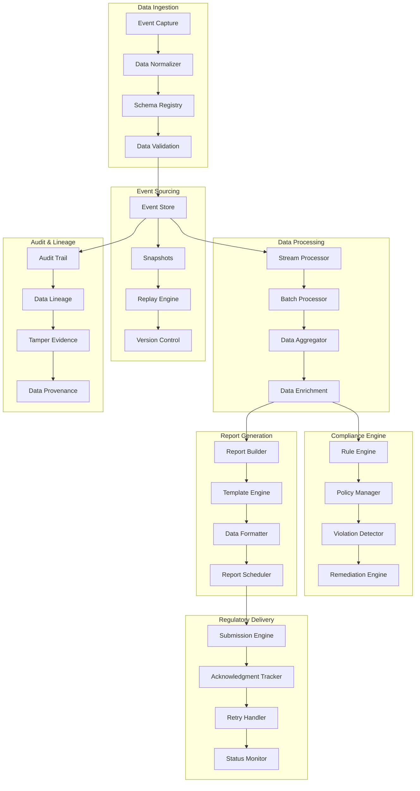

# RegTech Automated Reporting System

## Overview

A comprehensive regulatory technology (RegTech) system that automates compliance reporting, maintains tamper-evident audit trails, and ensures regulatory adherence across multiple jurisdictions. This system simulates modern RegTech platforms used by financial institutions to meet MiFID II, DORA, SOX, GDPR, and other regulatory requirements through automated data collection, processing, and reporting.

## Architecture



## Core Features

### ✅ Implemented Features

- [x] **Event Sourcing**: Complete event capture with replay capabilities
- [x] **Tamper-Evident Audit Trail**: Cryptographic integrity with hash chains
- [x] **Multi-Jurisdiction Reporting**: MiFID II, DORA, SOX, GDPR compliance
- [x] **Real-time Monitoring**: Continuous compliance monitoring
- [x] **Automated Report Generation**: Scheduled and on-demand reporting
- [x] **Data Lineage Tracking**: Complete data provenance and traceability
- [x] **Schema Evolution**: Backward-compatible schema management
- [x] **Regulatory Submission**: Automated regulatory filing

### 🔧 Technical Implementation

- [x] **Event-Driven Architecture**: Apache Kafka for event streaming
- [x] **Schema Management**: Confluent Schema Registry with Avro/Protobuf
- [x] **Immutable Storage**: Object storage with versioning and retention
- [x] **Stream Processing**: Apache Flink for real-time processing
- [x] **Batch Processing**: Apache Spark for large-scale data processing
- [x] **Time-series Analytics**: InfluxDB for regulatory metrics
- [x] **Document Generation**: Automated report formatting and delivery
- [x] **Cryptographic Integrity**: Digital signatures and hash verification

## Quick Start

### Prerequisites

- Docker & Docker Compose
- Java 17+ for Kafka and Flink services
- Python 3.9+ for data processing
- Go 1.21+ for core services
- Node.js 18+ for web interface

### 1. Start Infrastructure

```bash
# Start all required services
cd regtech-automated-reporting
docker-compose up -d

# Wait for services to be ready
./scripts/wait-for-services.sh
```

### 2. Initialize Schema Registry

```bash
# Setup Avro schemas for regulatory events
./scripts/setup-schemas.sh

# Register compliance rules and policies
./scripts/setup-compliance-rules.sh

# Initialize report templates
./scripts/setup-report-templates.sh
```

### 3. Start RegTech Services

```bash
# Build and start all services
make build-all
make start-all

# Verify system health
make health-check
```

### 4. Load Sample Data

```bash
# Generate sample regulatory events
./scripts/generate-sample-events.sh

# Process events through pipeline
make process-events

# Generate sample reports
make generate-reports
```

### 5. View Reports and Dashboards

```bash
# View compliance dashboard
make view-dashboard

# Generate regulatory reports
make generate-mifid-report
make generate-dora-report
```

## API Examples

### Submit Regulatory Event

```bash
curl -X POST https://localhost:8511/api/v1/events \
  -H "Content-Type: application/json" \
  -H "Authorization: Bearer $API_TOKEN" \
  -d '{
    "event_type": "TRADE_EXECUTION",
    "timestamp": "2024-01-15T10:30:00Z",
    "trade_id": "TRD001",
    "instrument": "AAPL",
    "quantity": "1000",
    "price": "150.25",
    "counterparty": "BROKER001",
    "venue": "NASDAQ"
  }'
```

### Generate Compliance Report

```bash
curl -X POST https://localhost:8512/api/v1/reports/generate \
  -H "Content-Type: application/json" \
  -H "Authorization: Bearer $API_TOKEN" \
  -d '{
    "report_type": "MIFID_TRANSACTION_REPORT",
    "start_date": "2024-01-01",
    "end_date": "2024-01-31",
    "jurisdiction": "EU",
    "format": "XML"
  }'
```

### Query Data Lineage

```bash
curl https://localhost:8513/api/v1/lineage/trace/TRD001 \
  -H "Authorization: Bearer $API_TOKEN"
```

### Verify Audit Trail

```bash
curl https://localhost:8514/api/v1/audit/verify \
  -H "Content-Type: application/json" \
  -H "Authorization: Bearer $API_TOKEN" \
  -d '{
    "event_id": "EVT001",
    "hash": "sha256:abc123...",
    "timestamp": "2024-01-15T10:30:00Z"
  }'
```

### Submit Report to Regulator

```bash
curl -X POST https://localhost:8515/api/v1/submissions \
  -H "Content-Type: application/json" \
  -H "Authorization: Bearer $API_TOKEN" \
  -d '{
    "report_id": "RPT001",
    "regulator": "ESMA",
    "submission_method": "SFTP",
    "priority": "HIGH"
  }'
```

### Check Compliance Status

```bash
curl https://localhost:8516/api/v1/compliance/status \
  -H "Authorization: Bearer $API_TOKEN" \
  -d '{
    "entity": "TRADING_DESK_001",
    "date": "2024-01-15"
  }'
```

## Test Scenarios

### Event Sourcing Tests

```bash
# Test event capture and replay
./tests/events/test-event-sourcing.sh

# Test schema evolution
./tests/events/test-schema-evolution.sh

# Test event replay accuracy
./tests/events/test-replay-accuracy.sh
```

### Audit Trail Tests

```bash
# Test tamper evidence
./tests/audit/test-tamper-evidence.sh

# Test data lineage tracking
./tests/audit/test-data-lineage.sh

# Test cryptographic integrity
./tests/audit/test-crypto-integrity.sh
```

### Compliance Tests

```bash
# Test MiFID II reporting
./tests/compliance/test-mifid-reporting.sh

# Test DORA compliance
./tests/compliance/test-dora-compliance.sh

# Test SOX controls
./tests/compliance/test-sox-controls.sh
```

### Report Generation Tests

```bash
# Test automated report generation
./tests/reports/test-report-generation.sh

# Test multi-format output
./tests/reports/test-report-formats.sh

# Test regulatory submission
./tests/reports/test-regulatory-submission.sh
```

### Performance Tests

```bash
# Test high-volume event processing
./tests/performance/test-event-throughput.sh

# Test report generation performance
./tests/performance/test-report-performance.sh

# Test system scalability
./tests/performance/test-scalability.sh
```

## Performance Metrics

### Processing Targets

- **Event Ingestion**: 100,000+ events/second
- **Stream Processing**: <100ms event-to-insight latency
- **Batch Processing**: 10M+ events/hour
- **Report Generation**: <5 minutes for standard reports
- **Audit Query**: <1 second for lineage queries
- **Schema Validation**: <10ms per event

### Throughput Targets

- **Regulatory Events**: 1M+ events/day processing
- **Report Generation**: 1000+ reports/day
- **Compliance Checks**: 10M+ checks/day
- **Audit Queries**: 100,000+ queries/day
- **Data Lineage**: 1M+ lineage traces/day

### Availability Targets

- **System Uptime**: 99.99% availability
- **Event Processing**: 99.95% success rate
- **Report Delivery**: 99.9% on-time delivery
- **Audit Trail**: 100% integrity guarantee
- **Regulatory Submission**: 99.95% success rate

## Monitoring & Observability

### Compliance Dashboard

Access the compliance dashboard at https://localhost:3009 (admin/regtech_admin)

Key metrics monitored:
- Real-time compliance status across jurisdictions
- Event processing rates and latencies
- Report generation and submission status
- Audit trail integrity and verification
- Regulatory deadline tracking
- Data quality and completeness metrics

### Audit Analytics

Access audit analytics at http://localhost:8517

Analytics include:
- Data lineage visualization
- Audit trail verification status
- Compliance violation trends
- Regulatory change impact analysis
- Data quality metrics
- Performance analytics

### Regulatory Reporting

Access regulatory reports at http://localhost:8518

Reporting features include:
- Automated MiFID II transaction reporting
- DORA operational resilience reporting
- SOX financial controls reporting
- GDPR data protection compliance
- Custom regulatory report generation
- Multi-jurisdiction report formatting

## Security & Compliance

### Data Security

- **Encryption**: AES-256 for data at rest and in transit
- **Access Control**: Role-based access with audit logging
- **Data Masking**: PII protection in non-production environments
- **Secure Storage**: Immutable object storage with versioning
- **Network Security**: TLS 1.3 with certificate pinning
- **Key Management**: Hardware security module integration

### Regulatory Compliance

- **MiFID II**: Transaction reporting and best execution
- **DORA**: Digital operational resilience requirements
- **SOX**: Financial reporting controls and audit trails
- **GDPR**: Data protection and privacy compliance
- **EMIR**: Derivatives reporting and risk mitigation
- **Basel III**: Capital adequacy and risk management

### Audit & Governance

- **Immutable Audit Logs**: Blockchain-based audit trail
- **Data Lineage**: Complete data provenance tracking
- **Tamper Evidence**: Cryptographic integrity verification
- **Compliance Monitoring**: Real-time violation detection
- **Regulatory Updates**: Automated rule updates
- **Change Management**: Versioned configuration management

## Directory Structure

```
regtech-automated-reporting/
├── services/
│   ├── event-ingestion/       # Event capture and validation (Go)
│   ├── stream-processor/      # Real-time event processing (Java/Flink)
│   ├── batch-processor/       # Large-scale data processing (Scala/Spark)
│   ├── compliance-engine/     # Rule engine and violation detection (Java)
│   ├── report-generator/      # Automated report generation (Python)
│   ├── audit-service/         # Audit trail and lineage (Go)
│   ├── submission-service/    # Regulatory submission (Go)
│   └── dashboard-service/     # Web dashboard (Node.js)
├── schemas/
│   ├── avro/                  # Avro schema definitions
│   ├── protobuf/              # Protocol buffer schemas
│   └── json-schema/           # JSON schema definitions
├── rules/
│   ├── mifid/                 # MiFID II compliance rules
│   ├── dora/                  # DORA compliance rules
│   ├── sox/                   # SOX compliance rules
│   └── gdpr/                  # GDPR compliance rules
├── templates/
│   ├── reports/               # Report templates
│   ├── notifications/         # Notification templates
│   └── submissions/           # Regulatory submission templates
├── infrastructure/
│   ├── docker-compose.yml     # Infrastructure services
│   ├── kafka/                 # Event streaming configuration
│   ├── flink/                 # Stream processing setup
│   ├── spark/                 # Batch processing configuration
│   └── monitoring/            # Observability stack
├── tests/
│   ├── events/                # Event sourcing tests
│   ├── audit/                 # Audit trail tests
│   ├── compliance/            # Compliance tests
│   ├── reports/               # Report generation tests
│   └── performance/           # Performance tests
├── scripts/                   # Automation and setup scripts
├── docs/                      # Technical documentation
└── Makefile                   # Build and deployment automation
```

## Supported Regulations

### European Union

- **MiFID II**: Markets in Financial Instruments Directive
- **DORA**: Digital Operational Resilience Act
- **EMIR**: European Market Infrastructure Regulation
- **GDPR**: General Data Protection Regulation
- **CRD IV**: Capital Requirements Directive
- **AIFMD**: Alternative Investment Fund Managers Directive

### United States

- **SOX**: Sarbanes-Oxley Act
- **Dodd-Frank**: Financial reform and consumer protection
- **CCAR**: Comprehensive Capital Analysis and Review
- **Volcker Rule**: Proprietary trading restrictions
- **FINRA**: Financial Industry Regulatory Authority rules
- **SEC**: Securities and Exchange Commission regulations

### Asia-Pacific

- **ASIC**: Australian Securities and Investments Commission
- **JFSA**: Japan Financial Services Agency
- **MAS**: Monetary Authority of Singapore
- **SFC**: Securities and Futures Commission (Hong Kong)
- **CSRC**: China Securities Regulatory Commission
- **FSS**: Financial Supervisory Service (South Korea)

## Advanced Features

### Event Sourcing

- **Complete Event Capture**: All business events stored immutably
- **Event Replay**: Reconstruct system state at any point in time
- **Snapshot Management**: Optimized state reconstruction
- **Schema Evolution**: Backward-compatible event schema changes
- **Event Versioning**: Multiple event versions support
- **Temporal Queries**: Query system state at specific timestamps

### Data Lineage

- **End-to-End Traceability**: Track data from source to report
- **Impact Analysis**: Understand downstream effects of changes
- **Data Quality Metrics**: Monitor data completeness and accuracy
- **Transformation Tracking**: Record all data transformations
- **Dependency Mapping**: Visualize data dependencies
- **Compliance Mapping**: Link data to regulatory requirements

### Automated Reporting

- **Template-Based Generation**: Flexible report templates
- **Multi-Format Output**: XML, JSON, CSV, PDF support
- **Scheduled Reporting**: Automated report generation
- **Real-Time Reporting**: On-demand report generation
- **Regulatory Formatting**: Jurisdiction-specific formatting
- **Quality Assurance**: Automated report validation

## Next Steps

1. **AI/ML Integration**: Machine learning for compliance prediction
2. **Blockchain Integration**: Distributed audit trail
3. **Real-Time Analytics**: Advanced streaming analytics
4. **Global Expansion**: Additional jurisdiction support
5. **API Ecosystem**: Third-party integration platform

## Contributing

See [CONTRIBUTING.md](./CONTRIBUTING.md) for development guidelines.

## License

MIT License - see [LICENSE](./LICENSE) for details.
